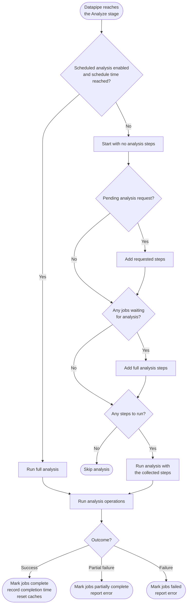

import PostProcessedEdges from '/snippets/analysis/post-processed-edges.mdx';
import defCompositeEdge from '/snippets/terms/composite-edge.mdx';

BloodHound Enterprise's analysis process includes several key steps that work together to surface findings and prioritize risk.

Use this reference to understand when the BloodHound data pipeline runs graph analysis and which conditions cause it to skip an analysis pass.

<Tip>
  For details about tenant status, job status, and the broader datapipe lifecycle, see [Monitor Data Collection](https://github.com/SpecterOps/bloodhound-docs/blob/main//collect-data/enterprise-collection/monitor).
</Tip>

## When analysis runs

The data pipeline runs on a repeating loop. On each loop iteration, the pipeline performs the following stages **in order**:

- **Purge**: Process any pending “delete collected graph data” requests.
- **Ingest**: Process uploaded/collected data files.
- **Analyze**: Enhance the graph and run [post-processing](https://github.com/SpecterOps/bloodhound-docs/blob/main//analyze-data/findings/analysis#post-processing).
- **Optimize**: Perform database-specific optimization tasks.

When the pipeline reaches the Analyze stage, it uses the decision tree below to determine whether analysis runs and which steps it performs.

## What triggers analysis

BloodHound evaluates the following triggers from top to bottom to determine whether analysis runs:

| Trigger | Result |
| --- | --- |
| **Scheduled analysis** | If recurring scheduled analysis is enabled and its next run time has passed, BloodHound runs a <Tooltip tip="All analysis steps are performed.">full analysis</Tooltip>. |
| **Requested analysis** | If a user or system action explicitly requests analysis, BloodHound runs the <Tooltip tip="A specific subset of steps attached to an explicit analysis request; may be merged with full steps if jobs are also waiting.">requested steps</Tooltip>. BloodHound also requests analysis after collected graph data is deleted. |
| **Jobs waiting for analysis** | If newly ingested data from ingest jobs or client collection jobs is waiting for analysis, BloodHound runs a full analysis. |

If none of these apply, the pipeline skips analysis for that iteration and moves on.

<Note>
  Scheduled analysis is a SpecterOps-managed feature.
</Note>

### Trigger behavior

- **Scheduling takes priority:** When scheduled analysis is due, BloodHound runs a full analysis and does not evaluate pending requests or waiting jobs during that Analyze phase.
- **Data deletion requests analysis:** When collected graph data is purged, BloodHound automatically requests a full analysis so the graph is reconciled during the next Analyze phase.
- **Waiting jobs require full analysis:** When ingest or client collection jobs are waiting for analysis, BloodHound runs the full analysis pipeline and updates the associated jobs after analysis completes.
- **Invalid schedules do not run:** If scheduled analysis is enabled but its recurrence rule is empty or invalid, scheduled analysis does not run until the schedule is corrected.

## Full analysis stages

When a trigger requires full analysis, BloodHound runs the analysis-specific stages in the following order:

1. Active Directory post-processing
1. Azure post-processing
1. Tagging
1. Analysis

BloodHound uses the full analysis pipeline for standard, scheduled, and job-driven analysis runs. Requested analysis can run a subset of analysis steps. [Variable Analysis Mode](https://github.com/SpecterOps/bloodhound-docs/blob/main//analyze-data/findings/analysis#variable-analysis-mode) enables BloodHound Enterprise to skip post-processing for some analysis runs to speed up the process (for example, when updating Privilege Zones).

## Choke point analysis

BloodHound Enterprise generates one <Tooltip tip="An aggregate view of the graph for a selected environment and privilege zone. It simplifies large volumes of nodes and edges into a compact visualization optimized for readability." cta="Learn more" href="/analyze-data/findings/graph-view">choke point</Tooltip> view per environment, such as an Active Directory domain or Azure tenant. The choke point view organizes findings by category and shows the number of exposed principals in each, helping you quickly understand where risk concentrates.

<Note>
  [Exposure and impact](https://github.com/SpecterOps/bloodhound-docs/blob/main//analyze-data/findings/graph-view#exposure-and-impact) metrics are calculated from this analysis and surfaced with findings.
</Note>

## Relationships and zone boundaries

Attack Path analysis includes both relationship-driven path analysis and principal-level risky configuration findings.

BloodHound evaluates how abusable relationships connect principals across privilege boundaries and flags principals with configurations that increase risk.

This includes boundaries between Tier Zero and user-defined [Privilege Zones](https://github.com/SpecterOps/bloodhound-docs/blob/main//analyze-data/privilege-zones/overview). A path that crosses zones can represent a stepping stone into higher-privilege assets, which is why zone-specific findings can differ in severity and priority.

## Post-processing

BloodHound does not rely only on directly collected relationships. During **post-processing**, it derives additional relationships that are relevant to Attack Path analysis. One result is a **composite edge**.

<defCompositeEdge />

<PostProcessedEdges />

## Variable Analysis Mode

When updating Privilege Zones, you likely want to see updated object membership and related findings as quickly as possible. **Variable Analysis Mode** can speed up this process. This feature is available under early access and is enabled by default.

**Variable Analysis Mode** skips the post-processing stages of analysis. BloodHound still updates normal analysis completion tracking after these runs, including timestamps and related status information.

<Note>
  This option applies to Privilege Zone-triggered analysis only. Other actions that trigger analysis still run the full pipeline.
</Note>

## Remediation

After reviewing findings on the **Attack Paths** page, you can:

- **Remediate** to sever the edges that create the risk and improve your environment's security posture.
- **Accept** when risk is known and temporarily tolerated.

For acceptance workflow steps, see [Risk Acceptance](https://github.com/SpecterOps/bloodhound-docs/blob/main//analyze-data/findings/risk-acceptance).

To track remediation progress over time, see [Posture](https://github.com/SpecterOps/bloodhound-docs/blob/main//analyze-data/findings/posture).
