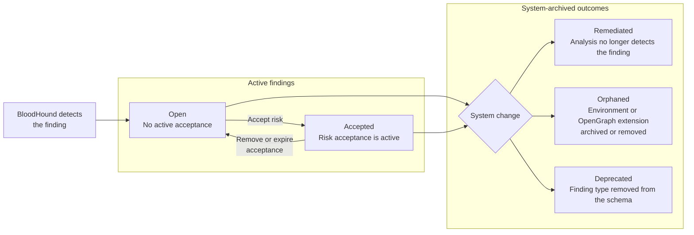

import BetaAccessNote from '/snippets/feature-flag-user-managed.mdx';

The **Findings Table** is an alternate view on the [Attack Paths](https://github.com/SpecterOps/bloodhound-docs/blob/main//analyze-data/findings/attack-paths) page. Use it to review many <Tooltip tip="A specific instance of an Attack Path that BloodHound Enterprise has identified as a high-value remediation point." cta="Learn more" href="/analyze-data/findings/attack-paths#findings">findings</Tooltip> at once, compare finding state across environments and zones, and triage high-volume result sets faster.

<BetaAccessNote feature="Findings Table" />

Each row in the table represents a single finding. The table displays the following columns:

| Column | Description |
| --- | --- |
| **Severity** | The severity of the finding:<ul><li>**Critical**</li><li>**High**</li><li>**Moderate**</li><li>**Low**</li></ul> |
| **Attack Path** | The Attack Path finding type. |
| **Platform** | The platform associated with the finding, such as Active Directory, Azure, or OpenGraph extension-defined platform. |
| **Environment** | The environment associated with the finding, such as an Active Directory domain, Azure tenant, or OpenGraph extension-defined environment. |
| **Zone** | The privilege zone associated with the finding for relationship-based findings (or Hygiene for list-based findings) |
| **Source Principal** | The principal where the Attack Path originates. |
| **Target Principal** | The principal where the Attack Path ends. |
| **First Seen** | When BloodHound Enterprise first created the finding. |
| **Last Seen** | When BloodHound Enterprise last updated the finding. |
| **Status** | The current status of the finding:<ul><li>**Open**</li><li>**Accepted**</li><li>**Remediated**</li><li>**Deprecated**</li><li>**Orphaned**</li></ul> See [Finding status lifecycle](#finding-status-lifecycle) for definitions and the actions that move a finding between statuses. |

<Note>
  Some findings, typically called [list-based findings](https://github.com/SpecterOps/bloodhound-docs/blob/main//analyze-data/findings/attack-paths#list-based-finding), do not have a source principal.
</Note>

## Use cases

Use the **Findings Table** to focus an investigation on a set of findings:

- **Triage findings at scale:** Review a dense list of Attack Path findings and sort by severity, date, status, or contextual columns.
- **Focus an investigation:** Filter by severity, platform, environment, zone, and status to move from a broad result set to a smaller set that matches your investigation goal.
- **Compare scope across environments or zones:** Select multiple environments or zones and review the matching findings together.
- **Review finding state and recency:** Use **Status**, **First Seen**, and **Last Seen** to understand whether findings are open, accepted, remediated, deprecated, or orphaned, and when BloodHound Enterprise last updated them.
- **Preserve table context:** Use the page URL to return to or share the same view, filters, and sort order.

## Prerequisites

Before you can use the **Findings Table**, you must have the following:

- BloodHound Enterprise with the **Findings Table** beta feature enabled on the **Early Access Features** page.
- Access to the environments you want to analyze.

  <Note>
    If [Environment Targeted Access Control (ETAC)](https://github.com/SpecterOps/bloodhound-docs/blob/main//manage-bloodhound/auth/environment-targeted-access-control) is enabled on your tenant, it can limit which findings and environments appear for your account. Two users can see different rows for the same filters depending on their access.
  </Note>

## Filter findings

Use filters to narrow the result set:

| Filter | What it does |
| --- | --- |
| **Severity** | Select one or more severity levels: **Critical**, **High**, **Moderate**, and **Low**. |
| **Platform** | Search for and select one or more platforms to focus on findings from specific sources. |
| **Environment** | Select one or more environments, such as an Active Directory domain, Azure tenant, or OpenGraph environment. |
| **Zone** | Select one or more privilege zones to focus on findings within those zones. |
| **Status** | Select one or more finding statuses: **Open**, **Accepted**, **Remediated**, **Deprecated**, and **Orphaned**. By default, the table shows **Open** and **Accepted** findings. |

The filters support multi-select. Selecting **All** for a filter removes that filter from the query. Clearing every value in a filter returns no rows until you select a value or return to **All**.

<Tip>
  Your filter and view selections are captured in the page URL. You can bookmark or share a link to return to the same table view.
</Tip>

## Sort findings

You can sort by each table column and resize column width. Sorting reorders the full result set for the current filters. For example:

- Sort by **First Seen** to distinguish newer findings from findings that have persisted across analysis runs.
- Sort by **Last Seen** to review the most recently updated findings for the current filters.

## Finding status lifecycle

A finding moves through a lifecycle as BloodHound Enterprise detects it, as you act on it, and as your environment changes. The **Status** column reflects where a finding is in that lifecycle. The diagram separates active findings from system-archived outcomes.

### Status definitions

The following table describes the stored value and meaning of each finding status, and whether the status marks a finding as archived.

| Status | Stored value | Meaning | Archived |
| --- | --- | --- | --- |
| **Open** | `active` | BloodHound currently detects the finding and no acceptance applies. This is the default state for a newly detected finding, and it needs attention. | No |
| **Accepted** | `accepted` | You accepted the finding as a known risk and the acceptance has not expired. Accepted findings remain in posture calculations. | No |
| **Remediated** | `remediated` | A later analysis run no longer detects the Attack Path, so BloodHound archived the finding. This reflects actual risk reduction. | Yes |
| **Orphaned** | `orphaned` | The environment or OpenGraph extension associated with the finding was archived or removed and is no longer collected, so BloodHound archived the finding. | Yes |
| **Deprecated** | `deprecated` | The finding type is no longer defined in the current schema, so BloodHound archived existing findings of that type. | Yes |

### User-driven transitions

You control the transition between **Open** and **Accepted**:

- **Open to Accepted:** Accept the finding and set an acceptance duration. BloodHound records an acceptance expiration for the finding. For steps, see [Risk Acceptance](https://github.com/SpecterOps/bloodhound-docs/blob/main//analyze-data/findings/risk-acceptance).
- **Accepted to Open:** Remove the acceptance manually, or wait for the acceptance period to expire. In both cases, the finding returns to **Open**.

### System-driven transitions

BloodHound sets the archived statuses automatically during analysis. You cannot set these statuses manually:

- **Remediated:** A subsequent analysis run no longer detects the Attack Path or vulnerable principal. Use this status to confirm that a risk was actually removed.
- **Orphaned:** The environment associated with the finding (such as an Active Directory domain or Azure tenant) is archived or removed and is no longer collected.
- **Deprecated:** The finding type is removed from (or deprecated in) the current schema, for example when an OpenGraph extension no longer defines it.

<Note>
  **Remediated**, **Orphaned**, and **Deprecated** are terminal, archived states. When BloodHound archives a finding, it records an archive time and updates the finding's last-updated time.

  **First Seen** reflects when the finding was first created, and **Last Seen** reflects the most recent update, including a status change. **Open** and **Accepted** findings are not archived and continue to count toward your posture.
</Note>
