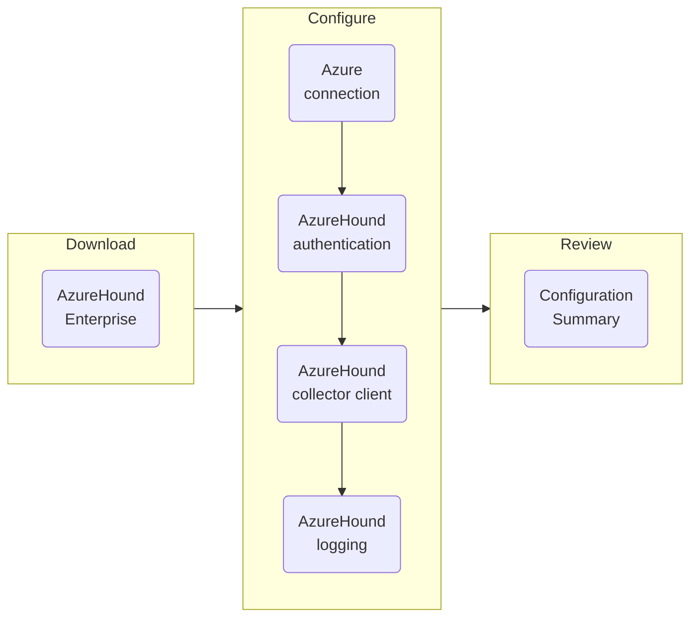

To complete the configuration process, you must have the following information:

| Item | Description |
| --- | --- |
| Directory (tenant) ID | Identifies the Microsoft Entra ID instance where you must [register](https://github.com/SpecterOps/bloodhound-docs/blob/main//install-data-collector/install-azurehound/azure-configuration) the AzureHound Enterprise application. |
| Application (client) ID | Identifies the AzureHound Enterprise [app registration](https://github.com/SpecterOps/bloodhound-docs/blob/main//install-data-collector/install-azurehound/azure-configuration) that you must create in the Microsoft Entra admin center. |
| AzureHound token ID | Identifies the AzureHound Enterprise [collector client](https://github.com/SpecterOps/bloodhound-docs/blob/main//collect-data/enterprise-collection/create-collector) that you must create in BloodHound Enterprise. |
| AzureHound token | Provides the authentication key for the AzureHound Enterprise [collector client](https://github.com/SpecterOps/bloodhound-docs/blob/main//collect-data/enterprise-collection/create-collector) that you must create in BloodHound Enterprise. |

Configuring AzureHound Enterprise involves the following steps:



Follow the steps below to create your AzureHound Enterprise configuration file using the AzureHound Enterprise CLI tool.

<Steps>
  <Step title="Download AzureHound Enterprise">
  1. Login to your BloodHound Enterprise tenant.

  1. In the left menu, click <Icon icon="download" icontype="regular" /> **Download Collectors**.

  1. Download the AzureHound Enterprise ZIP archive.

      <Note>Choose the option suitable for your system's architecture (ARM64 or AMD64).</Note>

  1. Extract the contents of the ZIP archive to a working directory on the system where you plan to run the AzureHound Enterprise binary.
  </Step>

  <Step title="Configure connection to Azure">
  1. Start the AzureHound Enterprise CLI tool with the `configure` command.

      ```text
      C:\Users\Administrator.ROOT\Downloads\azurehound-v2.0.5\azurehound-windows-amd64>azurehound.exe configure
      ```

      To see all available options, run `azurehound.exe -h`.

  1. Select the Azure region where your organization's tenant is hosted.

      <Note>Most organizations use the `cloud` region.</Note>

      ```text
      AzureHound v2.0.5
      Created by the BloodHound Enterprise team - https://bloodhoundenterprise.io

      Use the arrow keys to navigate: ↓ ↑ ← →
      ? Azure Region:
        china
      > cloud
        germany
        usgov14
        usgov15
      ```

  1.  Enter the Azure **Directory (tenant) ID**.

      ```text
      Directory (tenant) ID: b82887fc-338d-44ab-97d6-ac32d060ad7e
      ```

  1.  Enter the Azure **Application (client) ID** that you created when [registering](https://github.com/SpecterOps/bloodhound-docs/blob/main//install-data-collector/install-azurehound/azure-configuration) the AzureHound Enterprise application.

      ```text
      Application (client) ID: 18a7b927-9905-484e-8b17-c09630ce8ff2
      ```
  </Step>

  <Step title="Configure AzureHound authentication">
  1.  Select a method for authenticating AzureHound Enterprise to BloodHound Enterprise.

      <Note>We **highly** recommend certificate-based authentication.</Note>

      ```text
      Use the arrow keys to navigate: ↓ ↑ ← →
      ? Authentication Method:
        > Certificate
          Client Secret
          Username and Password
      ```

  1. If using Certificate authentication, press **Enter** or type `Y` to create a new certificate and key.

      ```text
      Authentication Method: Certificate
      ? Generate Certificate and Key? [Y/n]
      ```

      <Note>
      - The certificate generated by AzureHound expires after one year.
      - If using a certificate issued by another authority, AzureHound Enterprise supports certificates with the following characteristics:
        - PEM encoded
        - RSA 256
        - PKCS#8 or PKCS#5
      </Note>

  1. If using Certificate authentication, enter an optional passphrase for the private key.
  
        ```text
        Authentication Method: Certificate
        v Private Key Passphrase (optional):
        ```

  1. Press **Enter** (or enter `Y`) to connect to BloodHound Enterprise.

      ```text
      ? Setup connection to BloodHound Enterprise? [Y/n]
      ```

  1. Enter the URL of your BloodHound Enterprise tenant.

      ```text
      v BloodHound Enterprise URL: https://enterprise.bloodhoundenterprise.io/
      ```
  </Step>

  <Step title="Configure AzureHound collector client">

  1. Create an AzureHound [collector client](https://github.com/SpecterOps/bloodhound-docs/blob/main//collect-data/enterprise-collection/create-collector).

      Continue to the next step when you have the **Token ID** and **Token**.

  1. Enter the collector client's **Token ID**.

      ```text
      v BloodHound Enterprise Token ID: bb7b957f-2508-400b-971e-6a1857cc0101
      ```
  
  1. Enter the collector client's **Token**.

      ```text
      v BloodHound Enterprise Token: ****************************************
      ```

  1. (Optional) Enter `y` if you want to use a proxy URL.

      <Note>Most organizations do not use a proxy.</Note>

      ```text
      ? Set proxy URL? [y/N]
      ```
  </Step>

  <Step title="Configure AzureHound logging">

  1. Press **Enter** (or type `y`) to set up local logging.

      ```text
      ? Setup AzureHound logging? [Y/n]
      ```

  1. Select the logging verbosity, as a start we recommend **Default**.

      ```text
      Use the arrow keys to navigate: ↓ ↑ ← →
      ? Verbosity:
          Disabled      
        > Default
          Debug
          Trace
      ```

  1. Enter a name for the log file.

      <Tip>You can also enter a full path as a file name. If you do not specify a full path, AzureHound Enterprise writes logs to the specified file name and stores it in the same directory as the AzureHound binary.</Tip>

      ```text
      v Log file (optional): azurehound.log
      ```

  1. If you want AzureHound Enterprise to generate JSON-structured logs, press **Enter** or type `y`.

      ```text
      ? Enable Structured Logs? [y/N]
      ```
  </Step>

  <Step title="Review configuration summary">

  When configuration is complete, the AzureHound Enterprise CLI tool displays a configuration summary.

  ```text
  Configuration written to C:\Users\Administrator.ROOT\.config\azurehound\config.json
  Key written to C:\Users\Administrator.ROOT\.config\azurehound\key.pem
  Certificate written to C:\Users\Administrator.ROOT\.config\azurehound\cert.pem

  Ensure certificate is uploaded to your application's client credentials
  ```

  <Note>If you are using Certificate authentication, the summary also includes the location of the certificate to complete the configuration in Azure.</Note>
  </Step>
</Steps>
