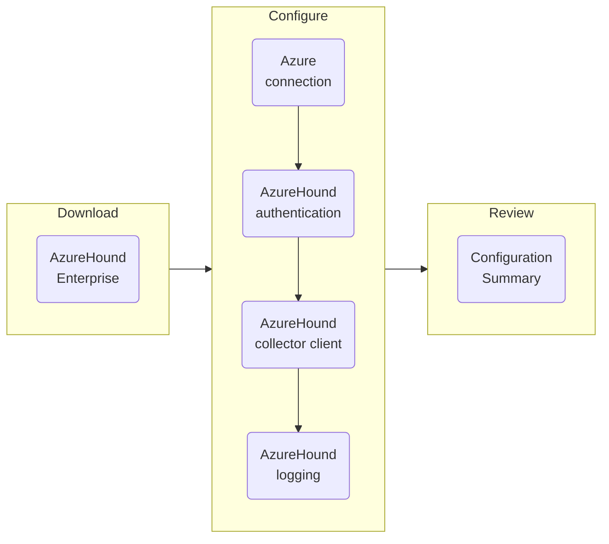

import ManagedIdentityRecommendation from '/snippets/hounds/managed-id-recommendation.mdx';


## Prerequisites

To complete the configuration process, you must have the following information:

| Item | Description |
| --- | --- |
| **Directory (tenant) ID** | Identifies the Microsoft Entra ID instance for your Azure environment. For Certificate, Client Secret, and Username and Password authentication, this is also the tenant where you must [register](https://github.com/SpecterOps/bloodhound-docs/blob/main//install-data-collector/install-azurehound/azure-configuration) the AzureHound Enterprise application. |
| **Application (client) ID** | Identifies the AzureHound Enterprise [app registration](https://github.com/SpecterOps/bloodhound-docs/blob/main//install-data-collector/install-azurehound/azure-configuration) that you must create in the Microsoft Entra admin center. For **Azure Managed Identity** authentication, use the managed identity's Client ID. |
| **AzureHound token ID** | Identifies the AzureHound Enterprise [collector client](https://github.com/SpecterOps/bloodhound-docs/blob/main//collect-data/enterprise-collection/create-collector) that you must create in BloodHound Enterprise. |
| **AzureHound token** | Provides the authentication key for the AzureHound Enterprise [collector client](https://github.com/SpecterOps/bloodhound-docs/blob/main//collect-data/enterprise-collection/create-collector) that you must create in BloodHound Enterprise. |
| **BloodHound Enterprise URL** | The URL of your BloodHound Enterprise tenant (for example, `https://<your-tenant>.bloodhoundenterprise.io/`). |
| **Managed Identity Client ID** | If using [Azure Managed Identity](https://github.com/SpecterOps/bloodhound-docs/blob/main//install-data-collector/install-azurehound/azure-configuration#managed-identity-recommended) authentication, identifies the managed identity assigned to the Azure resource where you run AzureHound Enterprise. |
| **Certificate and private key** | If using [Certificate](https://github.com/SpecterOps/bloodhound-docs/blob/main//install-data-collector/install-azurehound/azure-configuration#certificate) authentication, the certificate and private key used to authenticate the AzureHound Enterprise application. The AzureHound Enterprise CLI tool can generate this for you during the configuration process if needed. |

Configuring AzureHound Enterprise involves the following steps:


```mermaid
flowchart LR
    subgraph Download
        a(AzureHound
        Enterprise)
    end
    subgraph Configure
        b(Azure
        connection)-->c(AzureHound
         authentication)
        c-->d(AzureHound
         collector client)
        d-->e(AzureHound
         logging)
    end
    subgraph Review
        f(Configuration
        Summary)
    end
    Download-->Configure-->Review
```

Follow the steps below to create your AzureHound Enterprise configuration file using the AzureHound Enterprise CLI tool.

<Steps>
  <Step title="Download AzureHound Enterprise">
  1. Login to your BloodHound Enterprise tenant.

  1. In the left menu, click <Icon icon="download" icontype="regular" /> **Download Collectors**.

  1. Download the AzureHound Enterprise ZIP archive.

      <Note>Choose the option suitable for your system's architecture (ARM64 or AMD64).</Note>

  1. Extract the contents of the ZIP archive to a working directory on the system where you plan to run the AzureHound Enterprise binary.
  </Step>

  <Step title="Configure connection to Azure">
  1. Start the AzureHound Enterprise CLI tool with the `configure` command.

      ```text
      C:\Users\Administrator.ROOT\Downloads\azurehound-v2.8.2\azurehound-windows-amd64>azurehound.exe configure
      ```

      To see all available options, run `azurehound.exe -h`.

  1. Select the Azure region where your organization's tenant is hosted.

      <Note>Most organizations use the `cloud` region.</Note>

      ```text
      AzureHound v2.8.2
      Created by the BloodHound Enterprise team - https://bloodhoundenterprise.io

      Use the arrow keys to navigate: ↓ ↑ ← →
      ? Azure Region:
        china
      > cloud
        usgov14
        usgov15
      ```

  1.  Enter the Azure **Directory (tenant) ID**.

      ```text
      Directory (tenant) ID: b82887fc-338d-44ab-97d6-ac32d060ad7e
      ```

  1.  Enter the Azure **Application (client) ID** that you created when [registering](https://github.com/SpecterOps/bloodhound-docs/blob/main//install-data-collector/install-azurehound/azure-configuration) the AzureHound Enterprise application.

      ```text
      Application (client) ID: 18a7b927-9905-484e-8b17-c09630ce8ff2
      ```

      <Note>If you are using **Azure Managed Identity** authentication, enter the managed identity's **Client ID** here.</Note>
  </Step>

  <Step title="Configure AzureHound authentication">
  Choose one of the following authentication methods for AzureHound Enterprise to connect to your Microsoft Entra ID and Azure environment:

    <Tabs>
      <Tab title="Azure Managed Identity" icon="key">

      <ManagedIdentityRecommendation />

      Before configuring Azure Managed Identity authentication, you must first create a [user-assigned managed identity](https://github.com/SpecterOps/bloodhound-docs/blob/main//install-data-collector/install-azurehound/azure-configuration#managed-identity-recommended), assign it to the Azure resource where you plan to run AzureHound Enterprise, and grant the required permissions and AzureHound Reader role directly to the managed identity.

      1. Select **Azure Managed Identity** as the authentication method.

          ```text
          Use the arrow keys to navigate: ↓ ↑ ← →
          ? Authentication Method:
              Certificate
              Client Secret
              Username and Password
            > Azure Managed Identity
          ```

      1. Select **User-Assigned** as the Managed Identity type.

          ```text
          Use the arrow keys to navigate: ↓ ↑ ← →
          ? Managed Identity Type:
              System-Assigned
            > User-Assigned
          ```

      1. Enter the **Client ID** of the User-Assigned Managed Identity.

          ```text
          v Input the User-Assigned Managed Identity (Client ID):
          ```

          <Note>To find the Client ID, navigate to the Managed Identity in the Azure portal and copy the value from the **Client ID** field in the Overview.</Note>

      1. Press **Enter** (or enter `Y`) to connect to BloodHound Enterprise.

          ```text
          ? Setup connection to BloodHound Enterprise? [Y/n]
          ```

      1. Enter the URL of your BloodHound Enterprise tenant.

          ```text
          v BloodHound Enterprise URL: https://<your-tenant>.bloodhoundenterprise.io/
          ```
      </Tab>

      <Tab title="Certificate" icon="file-certificate">
      1. Select **Certificate** as the authentication method.

          ```text
          Use the arrow keys to navigate: ↓ ↑ ← →
          ? Authentication Method:
            > Certificate
              Client Secret
              Username and Password
              Azure Managed Identity
          ```

      1. Press **Enter** or type `Y` to create a new certificate and key.

          ```text
          Authentication Method: Certificate
          ? Generate Certificate and Key? [Y/n]
          ```

          <Note>
          - The certificate generated by AzureHound expires after one year.
          - If using a certificate issued by another authority, AzureHound Enterprise supports certificates with the following characteristics:
            - PEM encoded
            - RSA 256
            - PKCS#8 or PKCS#5
          </Note>

      1. Enter an optional passphrase for the private key.

          ```text
          Authentication Method: Certificate
          v Private Key Passphrase (optional):
          ```

      1. Press **Enter** (or enter `Y`) to connect to BloodHound Enterprise.

          ```text
          ? Setup connection to BloodHound Enterprise? [Y/n]
          ```

      1. Enter the URL of your BloodHound Enterprise tenant.

          ```text
          v BloodHound Enterprise URL: https://<your-tenant>.bloodhoundenterprise.io/
          ```
      </Tab>
    </Tabs>
  </Step>

  <Step title="Configure AzureHound collector client">

  1. Create an AzureHound [collector client](https://github.com/SpecterOps/bloodhound-docs/blob/main//collect-data/enterprise-collection/create-collector).

      Continue to the next step when you have the **Token ID** and **Token**.

  1. Enter the collector client's **Token ID**.

      ```text
      v BloodHound Enterprise Token ID: bb7b957f-2508-400b-971e-6a1857cc0101
      ```

  1. Enter the collector client's **Token**.

      ```text
      v BloodHound Enterprise Token: ****************************************
      ```

  1. (Optional) Enter `y` if you want to use a proxy URL.

      <Note>Most organizations do not use a proxy.</Note>

      ```text
      ? Set proxy URL? [y/N]
      ```
  </Step>

  <Step title="Configure AzureHound logging">

  1. Press **Enter** (or type `y`) to set up local logging.

      ```text
      ? Setup AzureHound logging? [Y/n]
      ```

  1. Select the logging verbosity, as a start we recommend **Default**.

      ```text
      Use the arrow keys to navigate: ↓ ↑ ← →
      ? Verbosity:
          Disabled
        > Default
          Debug
          Trace
      ```

  1. Enter a name for the log file.

      <Tip>You can also enter a full path as a file name. If you do not specify a full path, AzureHound Enterprise writes logs to the specified file name and stores it in the same directory as the AzureHound binary.</Tip>

      ```text
      v Log file (optional): azurehound.log
      ```

  1. If you want AzureHound Enterprise to generate JSON-structured logs, press **Enter** or type `y`.

      ```text
      ? Enable Structured Logs? [y/N]
      ```
  </Step>

  <Step title="Review configuration summary">

  When configuration is complete, the AzureHound Enterprise CLI tool displays a configuration summary.

  ```text
  Configuration written to C:\Users\Administrator.ROOT\.config\azurehound\config.json
  Key written to C:\Users\Administrator.ROOT\.config\azurehound\key.pem
  Certificate written to C:\Users\Administrator.ROOT\.config\azurehound\cert.pem

  Ensure certificate is uploaded to your application's client credentials
  ```

  <Note>The example above shows the summary for Certificate authentication. For Azure Managed Identity authentication, the summary omits the key and certificate paths and the certificate upload reminder.</Note>
  </Step>
</Steps>
