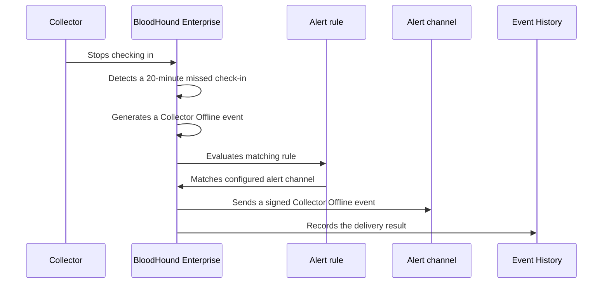

import EarlyAccessAccessNote from '/snippets/feature-flag-user-managed.mdx';

Alerts help you detect important conditions in your BloodHound Enterprise tenant and deliver notifications to the operational tools your team already monitors.

<EarlyAccessAccessNote feature="Alerts" />

During Early Access, Alerts support the **Collector Offline** event type and **Webhook** alert channel.

## Use cases

Use Alerts to keep BloodHound Enterprise events visible to the people and systems responsible for resolving them:

- **Detect important events sooner:** Send an alert event to a monitored endpoint so an operations team can investigate an issue promptly.
- **Connect collector health to existing workflows:** Route signed events through a generic webhook receiver that creates an incident, posts a message to an approved internal system, or starts an automation workflow.
- **Investigate delivery problems:** Review delivery attempts for an alert event alongside receiver logs to distinguish a collector outage from a webhook configuration or delivery failure.

## Key concepts

Use the following terms to distinguish the parts of the Alerts workflow:

| Term | Meaning |
| --- | --- |
| Alert event | A system-generated record for a condition that matches a rule, such as a collector remaining offline. BloodHound Enterprise sends the event to every matching alert channel. |
| Alert channel | A delivery method for alert events. **Webhook** is currently the only available alert channel. |
| Event trigger | An event type or condition that can cause an alert event. A trigger can represent something that happens or something that does not happen within a defined period.  Each type can support multiple payload versions. **Collector Offline** is currently the only available trigger. |
| Rule | A configuration that specifies an event trigger and maps it to one or more alert channel configurations. |
| Webhook | A reusable alert channel configuration for delivering alert events based on an event trigger. |

<Note>
  Treat alert channels as reusable configurations, not as children of a rule. For example, multiple rules can send events to the same webhook.
</Note>

## How alerts work

You configure alert channels in **Delivery**, configure which event type triggers an alert event in **Rules**, and review alert channel delivery attempts in **Event History**.

| Page | Purpose | What you configure or review |
| --- | --- | --- |
| **Delivery** | Defines where BloodHound Enterprise sends alert events. | Create and manage generic HTTPS webhooks, including their HMAC secrets. |
| **Rules** | Defines which event type triggers an alert channel. | Create a rule that sends matching alert events to selected alert channels. |
| **Event History** | Records alert channel delivery activity. | Review delivery attempts, delivery state, and errors when you investigate an event or an alert channel. |

Each alert channel configuration has a [health signal](https://github.com/SpecterOps/bloodhound-docs/blob/main//manage-bloodhound/alerts/configure#webhook-health). BloodHound Enterprise updates this signal from dispatch outcomes so you can identify destinations that may not receive alerts. Health belongs to the delivery destination; it does not describe the alert event type or rule.

<Note>
  Your BloodHound Enterprise user role determines permissions on the Alerts pages:

  - Administrators have read-write access to all pages.
  - Auditors have read-only access to all pages.
</Note>

An example **Alerts** workflow involves the following steps:

1. Create a webhook on the **Delivery** page.
1. Create a rule that links the webhook to an event trigger (such as **Collector Offline**) on the **Rules** page.
1. When BloodHound Enterprise generates a matching alert event, it evaluates enabled rules, queues a delivery attempt for each configured webhook, sends the signed event, and records the outcome on the **Event History** page.

<Tip>
  See [Configure alerts](https://github.com/SpecterOps/bloodhound-docs/blob/main//manage-bloodhound/alerts/configure) for detailed instructions.
</Tip>

An alert workflow has three parts:

- BloodHound Enterprise detects a system event or condition
- An alert rule determines whether to notify you
- A channel delivers the notification

BloodHound Enterprise periodically evaluates alert conditions. During Early Access, it evaluates collector check-in status approximately every seven minutes. A collector that remains offline normally causes BloodHound Enterprise to create an alert event about 20 to 27 minutes after its last check-in.

<Note>
  To avoid redundant alert events, BloodHound Enterprise does not send another **Collector Offline** event for the same collector for seven days while the collector remains unavailable. BloodHound Enterprise does not send a recovery event when the collector checks in again.
</Note>

## Next steps

- [Configure a webhook](https://github.com/SpecterOps/bloodhound-docs/blob/main//manage-bloodhound/alerts/configure) to configure an alert channel and rule.
- [Review the webhook contract](https://github.com/SpecterOps/bloodhound-docs/blob/main//integrations/webhooks/alert-webhook-contract) before you connect a receiver.
- [Troubleshoot webhook delivery](https://github.com/SpecterOps/bloodhound-docs/blob/main//manage-bloodhound/alerts/troubleshoot) when Event History shows delivery failures.
