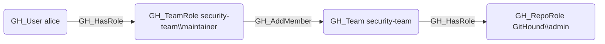

## Edge Schema

- Source: [GH_TeamRole](https://github.com/SpecterOps/bloodhound-docs/blob/main//opengraph/extensions/githound/reference/nodes/gh_teamrole)
- Destination: [GH_Team](https://github.com/SpecterOps/bloodhound-docs/blob/main//opengraph/extensions/githound/reference/nodes/gh_team)
- Traversable: ✅

## General Information

The traversable [GH_AddMember](https://github.com/SpecterOps/bloodhound-docs/blob/main//opengraph/extensions/githound/reference/edges/gh_addmember) edge indicates that a team role with the Maintainer permission level can add new members to the team. It is created by `Git-HoundTeam` when enumerating team membership roles. This edge is traversable because the ability to add members grants indirect access -- a maintainer can add any user to the team, and that user then inherits all of the team's repository permissions, effectively expanding the attack surface.

