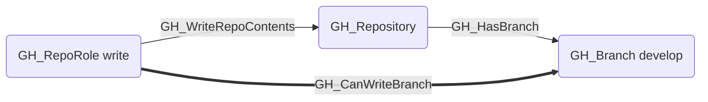
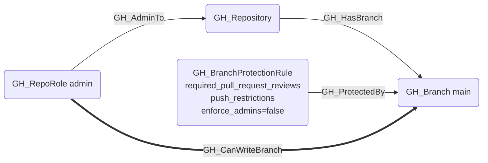
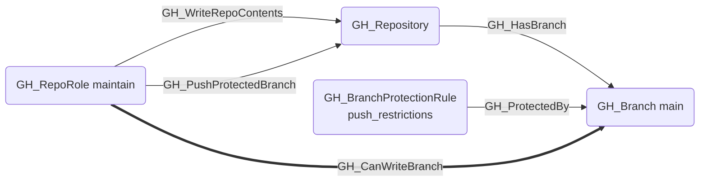
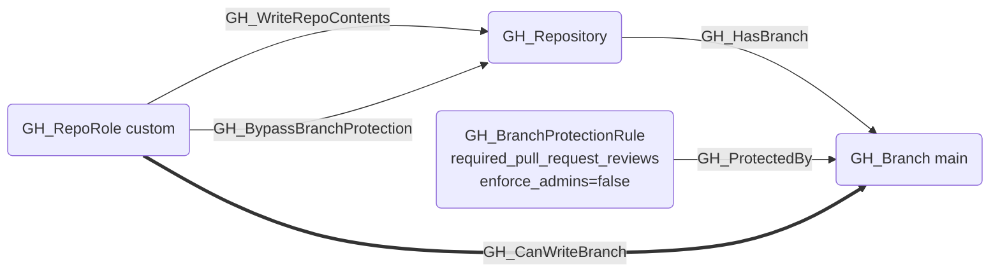
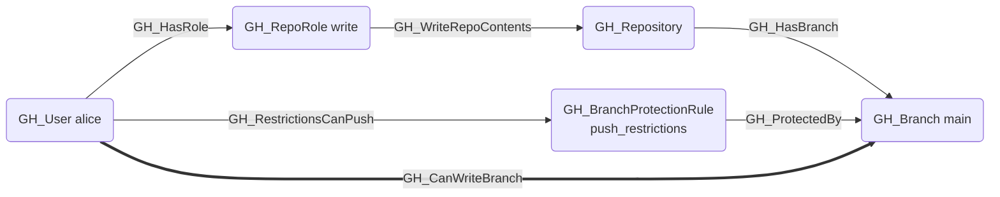
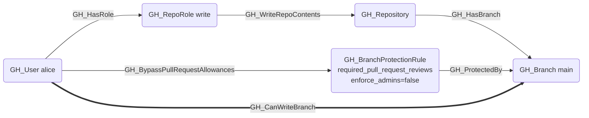

## Edge Schema

- Source: [GH_RepoRole](https://github.com/SpecterOps/bloodhound-docs/blob/main//opengraph/extensions/githound/reference/nodes/gh_reporole), [GH_User](https://github.com/SpecterOps/bloodhound-docs/blob/main//opengraph/extensions/githound/reference/nodes/gh_user), [GH_Team](https://github.com/SpecterOps/bloodhound-docs/blob/main//opengraph/extensions/githound/reference/nodes/gh_team)
- Destination: [GH_Branch](https://github.com/SpecterOps/bloodhound-docs/blob/main//opengraph/extensions/githound/reference/nodes/gh_branch)
- Traversable: ✅

## General Information

The traversable [GH_CanWriteBranch](https://github.com/SpecterOps/bloodhound-docs/blob/main//opengraph/extensions/githound/reference/edges/gh_canwritebranch) edge is a computed edge indicating that a role or actor can push to a specific branch. Created by `Compute-GitHoundBranchAccess` with no additional API calls, the computation evaluates both the merge gate (PR review requirements) and push gate (push restrictions) of any branch protection rule protecting the branch. Role-level edges are the common case; per-actor edges from [GH_User](https://github.com/SpecterOps/bloodhound-docs/blob/main//opengraph/extensions/githound/reference/nodes/gh_user) or [GH_Team](https://github.com/SpecterOps/bloodhound-docs/blob/main//opengraph/extensions/githound/reference/nodes/gh_team) are only emitted when BPR allowances grant access beyond what the role provides. Each edge includes a `reason` property (`no_protection`, `admin`, `push_protected_branch`, `bypass_branch_protection`, `push_allowance`, `bypass_pr_allowance`) and a `query_composition` Cypher query showing the underlying graph evidence.

## Scenarios

### `no_protection` — Unprotected branch

Branch has no BPR. Any write-capable role can push directly.

### `admin` — Admin bypasses both gates

BPR blocks both the merge gate (PR reviews) and push gate (push_restrictions). The admin role bypasses both gates. Requires `enforce_admins=false`; when `enforce_admins=true`, admin cannot bypass the merge gate.

### `push_protected_branch` — Push gate bypass

Push gate blocked by `push_restrictions` (no merge gate block). The [GH_PushProtectedBranch](https://github.com/SpecterOps/bloodhound-docs/blob/main//opengraph/extensions/githound/reference/edges/gh_pushprotectedbranch) permission bypasses the push gate regardless of `enforce_admins`.

### `bypass_branch_protection` — Merge gate bypass

Merge gate blocked by PR reviews. The [GH_BypassBranchProtection](https://github.com/SpecterOps/bloodhound-docs/blob/main//opengraph/extensions/githound/reference/edges/gh_bypassbranchprotection) permission bypasses the merge gate. Requires `enforce_admins=false`; suppressed when `enforce_admins=true`.

### `push_allowance` — Per-actor push restriction bypass

User or Team listed in the BPR's `pushAllowances` bypasses the push gate. This is a per-actor delta edge — only emitted when the actor's role-level access doesn't already cover the branch.

### `bypass_pr_allowance` — Per-actor PR review bypass

User or Team listed in the BPR's `bypassPullRequestAllowances` bypasses the merge gate (PR reviews only, not `lock_branch`). Requires `enforce_admins=false`. This is a per-actor delta edge — only emitted when the actor's role-level access doesn't already cover the branch.

