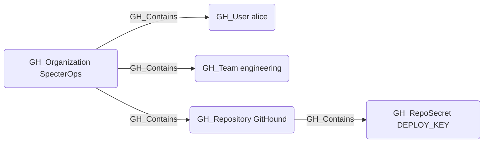

## Edge Schema

- Source: [GH_Organization](https://github.com/SpecterOps/bloodhound-docs/blob/main//opengraph/extensions/githound/reference/nodes/gh_organization), [GH_Repository](https://github.com/SpecterOps/bloodhound-docs/blob/main//opengraph/extensions/githound/reference/nodes/gh_repository), [GH_Environment](https://github.com/SpecterOps/bloodhound-docs/blob/main//opengraph/extensions/githound/reference/nodes/gh_environment)
- Destination: [GH_User](https://github.com/SpecterOps/bloodhound-docs/blob/main//opengraph/extensions/githound/reference/nodes/gh_user), [GH_Team](https://github.com/SpecterOps/bloodhound-docs/blob/main//opengraph/extensions/githound/reference/nodes/gh_team), [GH_Repository](https://github.com/SpecterOps/bloodhound-docs/blob/main//opengraph/extensions/githound/reference/nodes/gh_repository), [GH_OrgRole](https://github.com/SpecterOps/bloodhound-docs/blob/main//opengraph/extensions/githound/reference/nodes/gh_orgrole), [GH_RepoRole](https://github.com/SpecterOps/bloodhound-docs/blob/main//opengraph/extensions/githound/reference/nodes/gh_reporole), [GH_TeamRole](https://github.com/SpecterOps/bloodhound-docs/blob/main//opengraph/extensions/githound/reference/nodes/gh_teamrole), [GH_OrgSecret](https://github.com/SpecterOps/bloodhound-docs/blob/main//opengraph/extensions/githound/reference/nodes/gh_orgsecret), [GH_AppInstallation](https://github.com/SpecterOps/bloodhound-docs/blob/main//opengraph/extensions/githound/reference/nodes/gh_appinstallation), [GH_PersonalAccessToken](https://github.com/SpecterOps/bloodhound-docs/blob/main//opengraph/extensions/githound/reference/nodes/gh_personalaccesstoken), [GH_PersonalAccessTokenRequest](https://github.com/SpecterOps/bloodhound-docs/blob/main//opengraph/extensions/githound/reference/nodes/gh_personalaccesstokenrequest), [GH_RepoSecret](https://github.com/SpecterOps/bloodhound-docs/blob/main//opengraph/extensions/githound/reference/nodes/gh_reposecret), [GH_EnvironmentSecret](https://github.com/SpecterOps/bloodhound-docs/blob/main//opengraph/extensions/githound/reference/nodes/gh_environmentsecret), [GH_SecretScanningAlert](https://github.com/SpecterOps/bloodhound-docs/blob/main//opengraph/extensions/githound/reference/nodes/gh_secretscanningalert)
- Traversable: ❌

## General Information

The non-traversable [GH_Contains](https://github.com/SpecterOps/bloodhound-docs/blob/main//opengraph/extensions/githound/reference/edges/gh_contains) edge represents structural containment within the GitHub resource hierarchy. The organization serves as the top-level container for users, teams, repositories, roles, secrets, app installations, and personal access tokens. Repositories contain their own repo-level secrets, and environments contain environment-scoped secrets. This edge is created by the collector to establish the organizational hierarchy of GitHub resources and is not traversable because containment alone does not imply privilege escalation.

