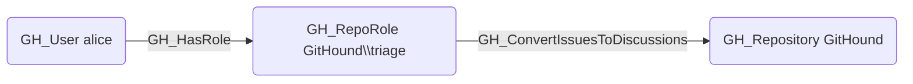

## Edge Schema

- Source: [GH_RepoRole](https://github.com/SpecterOps/bloodhound-docs/blob/main//opengraph/extensions/githound/reference/nodes/gh_reporole)
- Destination: [GH_Repository](https://github.com/SpecterOps/bloodhound-docs/blob/main//opengraph/extensions/githound/reference/nodes/gh_repository)
- Traversable: ❌

## General Information

The non-traversable [GH_ConvertIssuesToDiscussions](https://github.com/SpecterOps/bloodhound-docs/blob/main//opengraph/extensions/githound/reference/edges/gh_convertissuestodiscussions) edge represents a role's ability to convert issues to discussions, moving them from the issue tracker to the discussions forum. This permission is available to Triage, Write, Maintain, and Admin roles and custom roles that have been granted this specific permission.

