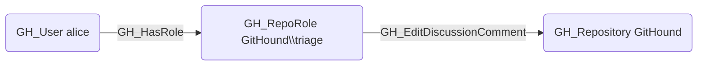

## Edge Schema

- Source: [GH_RepoRole](https://github.com/SpecterOps/bloodhound-docs/blob/main//opengraph/extensions/githound/reference/nodes/gh_reporole)
- Destination: [GH_Repository](https://github.com/SpecterOps/bloodhound-docs/blob/main//opengraph/extensions/githound/reference/nodes/gh_repository)
- Traversable: ❌

## General Information

The non-traversable [GH_EditDiscussionComment](https://github.com/SpecterOps/bloodhound-docs/blob/main//opengraph/extensions/githound/reference/edges/gh_editdiscussioncomment) edge represents a role's ability to edit discussion comments authored by any user. This permission is available to Triage, Write, Maintain, and Admin roles and custom roles that have been granted this specific permission.

