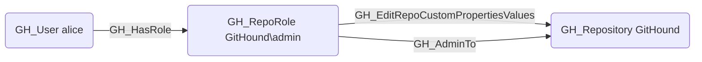

## Edge Schema

- Source: [GH_RepoRole](https://github.com/SpecterOps/bloodhound-docs/blob/main//opengraph/extensions/githound/reference/nodes/gh_reporole)
- Destination: [GH_Repository](https://github.com/SpecterOps/bloodhound-docs/blob/main//opengraph/extensions/githound/reference/nodes/gh_repository)
- Traversable: ❌

## General Information

The non-traversable [GH_EditRepoCustomPropertiesValues](https://github.com/SpecterOps/bloodhound-docs/blob/main//opengraph/extensions/githound/reference/edges/gh_editrepocustompropertiesvalues) edge represents a role's ability to edit custom property values on the repository. This permission is available to Admin roles and custom roles that have been granted this specific permission. Custom properties are organization-defined metadata fields on repositories that can be used for classification, compliance tagging, or policy enforcement via rulesets. Modifying custom property values could alter which organization-level rulesets apply to the repository, potentially bypassing security controls that are scoped by property-based targeting.

