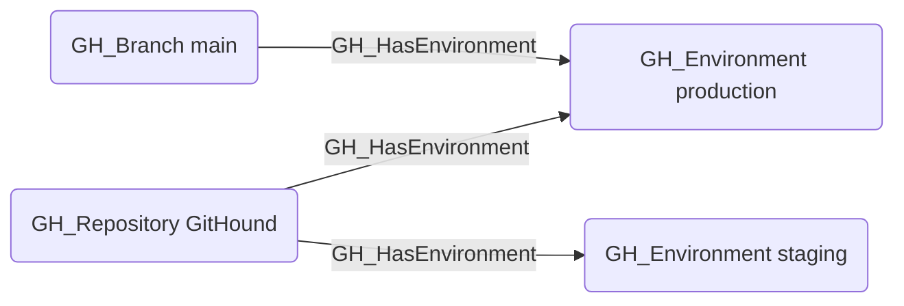

## Edge Schema

- Source: [GH_Repository](https://github.com/SpecterOps/bloodhound-docs/blob/main//opengraph/extensions/githound/reference/nodes/gh_repository), [GH_Branch](https://github.com/SpecterOps/bloodhound-docs/blob/main//opengraph/extensions/githound/reference/nodes/gh_branch)
- Destination: [GH_Environment](https://github.com/SpecterOps/bloodhound-docs/blob/main//opengraph/extensions/githound/reference/nodes/gh_environment)
- Traversable: ❌

## General Information

The non-traversable [GH_HasEnvironment](https://github.com/SpecterOps/bloodhound-docs/blob/main//opengraph/extensions/githound/reference/edges/gh_hasenvironment) edge represents the relationship between a repository or branch and its deployment environments. Created by `Git-HoundEnvironment`, this edge links environments to the repositories that define them and to the branches that are allowed to deploy to them (via deployment branch policies). Environments are security-relevant because they can gate access to secrets and cloud credentials, and their deployment branch policies control which branches can trigger deployments.

