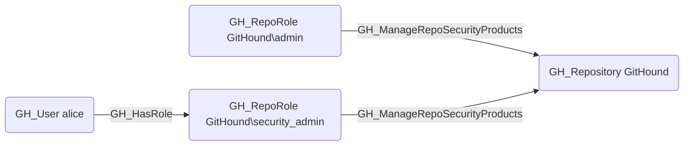

## Edge Schema

- Source: [GH_RepoRole](https://github.com/SpecterOps/bloodhound-docs/blob/main//opengraph/extensions/githound/reference/nodes/gh_reporole)
- Destination: [GH_Repository](https://github.com/SpecterOps/bloodhound-docs/blob/main//opengraph/extensions/githound/reference/nodes/gh_repository)
- Traversable: ❌

## General Information

The non-traversable [GH_ManageRepoSecurityProducts](https://github.com/SpecterOps/bloodhound-docs/blob/main//opengraph/extensions/githound/reference/edges/gh_managereposecurityproducts) edge represents a role's ability to manage repository-specific security product settings. This permission is available to Admin roles and custom roles that have been granted this specific permission. Unlike the broader [GH_ManageSecurityProducts](https://github.com/SpecterOps/bloodhound-docs/blob/main//opengraph/extensions/githound/reference/edges/gh_managesecurityproducts) permission, this edge is scoped to repository-level security configuration such as repository-specific scanning settings and alert management. Disabling repository-level security products can create blind spots in vulnerability detection for the specific repository.

