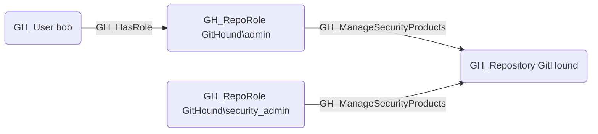

## Edge Schema

- Source: [GH_RepoRole](https://github.com/SpecterOps/bloodhound-docs/blob/main//opengraph/extensions/githound/reference/nodes/gh_reporole)
- Destination: [GH_Repository](https://github.com/SpecterOps/bloodhound-docs/blob/main//opengraph/extensions/githound/reference/nodes/gh_repository)
- Traversable: ❌

## General Information

The non-traversable [GH_ManageSecurityProducts](https://github.com/SpecterOps/bloodhound-docs/blob/main//opengraph/extensions/githound/reference/edges/gh_managesecurityproducts) edge represents a role's ability to manage security product settings on the repository. This permission is available to Admin roles and custom roles that have been granted this specific permission. Managing security products allows enabling or disabling features such as secret scanning, code scanning, and Dependabot alerts. An attacker with this permission could disable security features to prevent detection of vulnerabilities or leaked secrets, making this a high-severity permission for security posture management.

