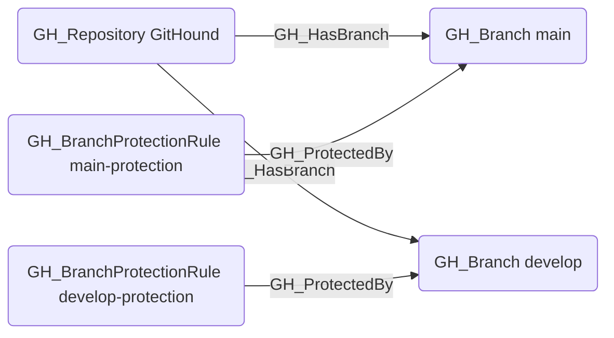

## Edge Schema

- Source: [GH_BranchProtectionRule](https://github.com/SpecterOps/bloodhound-docs/blob/main//opengraph/extensions/githound/reference/nodes/gh_branchprotectionrule)
- Destination: [GH_Branch](https://github.com/SpecterOps/bloodhound-docs/blob/main//opengraph/extensions/githound/reference/nodes/gh_branch)
- Traversable: ❌

## General Information

The non-traversable [GH_ProtectedBy](https://github.com/SpecterOps/bloodhound-docs/blob/main//opengraph/extensions/githound/reference/edges/gh_protectedby) edge represents that a branch protection rule applies to a specific branch. Created by `Git-HoundBranch` when branch protection rules are collected, this edge links protection rules to the branches they govern. Understanding which protections apply to a branch is critical for determining the effective access model — protections such as required reviews, status checks, and push restrictions directly impact who can modify a branch. This edge is consumed by the computed edge functions (`Compute-GitHoundBranchAccess`) to determine effective push access; the computed [GH_CanWriteBranch](https://github.com/SpecterOps/bloodhound-docs/blob/main//opengraph/extensions/githound/reference/edges/gh_canwritebranch) and [GH_CanEditProtection](https://github.com/SpecterOps/bloodhound-docs/blob/main//opengraph/extensions/githound/reference/edges/gh_caneditprotection) edges carry traversability instead.

