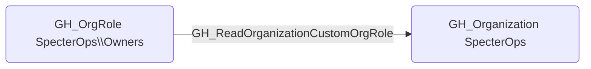

## Edge Schema

- Source: [GH_OrgRole](https://github.com/SpecterOps/bloodhound-docs/blob/main//opengraph/extensions/githound/reference/nodes/gh_orgrole)
- Destination: [GH_Organization](https://github.com/SpecterOps/bloodhound-docs/blob/main//opengraph/extensions/githound/reference/nodes/gh_organization)
- Traversable: ❌

## General Information

The non-traversable [GH_ReadOrganizationCustomOrgRole](https://github.com/SpecterOps/bloodhound-docs/blob/main//opengraph/extensions/githound/reference/edges/gh_readorganizationcustomorgrole) edge represents that a role can read custom organization role definitions. This edge is dynamically generated from custom organization role permissions discovered by the collector. Reading custom org role definitions allows a user to enumerate the permissions granted to each custom role, which provides reconnaissance value for understanding the organization's access control model and identifying roles with elevated privileges.

