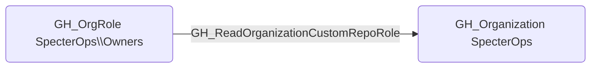

## Edge Schema

- Source: [GH_OrgRole](https://github.com/SpecterOps/bloodhound-docs/blob/main//opengraph/extensions/githound/reference/nodes/gh_orgrole)
- Destination: [GH_Organization](https://github.com/SpecterOps/bloodhound-docs/blob/main//opengraph/extensions/githound/reference/nodes/gh_organization)
- Traversable: ❌

## General Information

The non-traversable [GH_ReadOrganizationCustomRepoRole](https://github.com/SpecterOps/bloodhound-docs/blob/main//opengraph/extensions/githound/reference/edges/gh_readorganizationcustomreporole) edge represents that a role can read custom repository role definitions. This edge is dynamically generated from custom organization role permissions discovered by the collector. Reading custom repo role definitions allows a user to enumerate the permissions granted to each custom repository role, which provides reconnaissance value for understanding repository-level access controls and identifying roles that grant elevated repository permissions.

