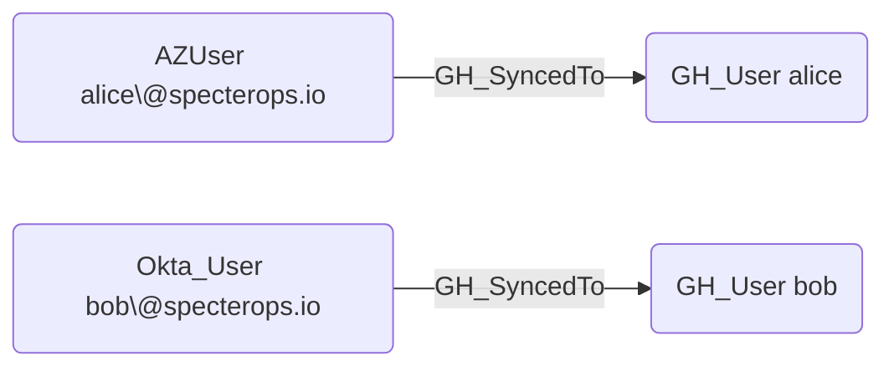

## Edge Schema

- Source: [AZUser](https://github.com/SpecterOps/bloodhound-docs/blob/main//resources/nodes/az-user), [Okta_User](https://github.com/SpecterOps/bloodhound-docs/blob/main//opengraph/extensions/oktahound/reference/nodes/okta_user), [PingOneUser](https://github.com/andyrobbins/PingOneHound?tab=readme-ov-file#schema)
- Destination: [GH_User](https://github.com/SpecterOps/bloodhound-docs/blob/main//opengraph/extensions/githound/reference/nodes/gh_user)
- Traversable: ✅

## General Information

The traversable [GH_SyncedTo](https://github.com/SpecterOps/bloodhound-docs/blob/main//opengraph/extensions/githound/reference/edges/gh_syncedto) edge is a hybrid edge that maps an external IdP user to a GitHub user based on SCIM provisioning. Created by `Git-HoundScimUser` when SCIM data links an external identity to a GitHub account, this edge represents a confirmed identity linkage between an external identity provider and GitHub. It is traversable because compromising the IdP account provides a verified path to the corresponding GitHub account, making it a critical edge for cross-system attack path analysis. This edge enables analysts to trace access from enterprise identity providers like Azure AD, Okta, or PingOne into the GitHub environment.

