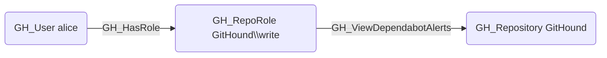

## Edge Schema

- Source: [GH_RepoRole](https://github.com/SpecterOps/bloodhound-docs/blob/main//opengraph/extensions/githound/reference/nodes/gh_reporole)
- Destination: [GH_Repository](https://github.com/SpecterOps/bloodhound-docs/blob/main//opengraph/extensions/githound/reference/nodes/gh_repository)
- Traversable: ❌

## General Information

The non-traversable [GH_ViewDependabotAlerts](https://github.com/SpecterOps/bloodhound-docs/blob/main//opengraph/extensions/githound/reference/edges/gh_viewdependabotalerts) edge represents a role's ability to view Dependabot security alerts, which reveal known vulnerabilities in the repository's dependencies. This permission is available to Write, Maintain, and Admin roles and custom roles that have been granted this specific permission. This information could be used to identify and exploit unpatched vulnerabilities.

