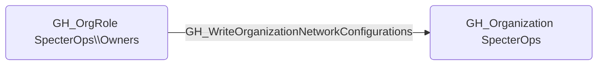

## Edge Schema

- Source: [GH_OrgRole](https://github.com/SpecterOps/bloodhound-docs/blob/main//opengraph/extensions/githound/reference/nodes/gh_orgrole)
- Destination: [GH_Organization](https://github.com/SpecterOps/bloodhound-docs/blob/main//opengraph/extensions/githound/reference/nodes/gh_organization)
- Traversable: ❌

## General Information

The non-traversable [GH_WriteOrganizationNetworkConfigurations](https://github.com/SpecterOps/bloodhound-docs/blob/main//opengraph/extensions/githound/reference/edges/gh_writeorganizationnetworkconfigurations) edge represents that a role can modify organization network configurations. This edge is dynamically generated from custom organization role permissions discovered by the collector. Network configurations control how GitHub-hosted runners connect to private resources such as internal APIs, databases, and cloud services. An attacker with this permission could modify network settings to route runner traffic through attacker-controlled infrastructure or grant runners access to previously isolated network segments.

