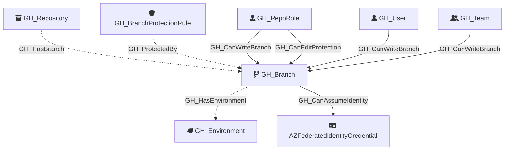

Represents a Git branch within a repository. Branch nodes capture basic branch information and whether the branch is protected. Protection rule details are stored in separate [GH_BranchProtectionRule](https://github.com/SpecterOps/bloodhound-docs/blob/main//opengraph/extensions/githound/reference/nodes/gh_branchprotectionrule) nodes, linked via [GH_ProtectedBy](https://github.com/SpecterOps/bloodhound-docs/blob/main//opengraph/extensions/githound/reference/edges/gh_protectedby) edges.

Created by: `Git-HoundBranch`

## Edges

<Note>
The tables below list edges defined by the GitHound extension only. Additional edges to or from this node may be created by other extensions.
</Note>

### Inbound Edges

| Edge Type | Source Node Types | Traversable |
| --------- | ----------------- | ----------- |
| [GH_CanEditProtection](https://github.com/SpecterOps/bloodhound-docs/blob/main//opengraph/extensions/githound/reference/edges/gh_caneditprotection) | [GH_RepoRole](https://github.com/SpecterOps/bloodhound-docs/blob/main//opengraph/extensions/githound/reference/nodes/gh_reporole) | ✅ |
| [GH_CanWriteBranch](https://github.com/SpecterOps/bloodhound-docs/blob/main//opengraph/extensions/githound/reference/edges/gh_canwritebranch) | [GH_RepoRole](https://github.com/SpecterOps/bloodhound-docs/blob/main//opengraph/extensions/githound/reference/nodes/gh_reporole), [GH_User](https://github.com/SpecterOps/bloodhound-docs/blob/main//opengraph/extensions/githound/reference/nodes/gh_user), [GH_Team](https://github.com/SpecterOps/bloodhound-docs/blob/main//opengraph/extensions/githound/reference/nodes/gh_team) | ✅ |
| [GH_HasBranch](https://github.com/SpecterOps/bloodhound-docs/blob/main//opengraph/extensions/githound/reference/edges/gh_hasbranch) | [GH_Repository](https://github.com/SpecterOps/bloodhound-docs/blob/main//opengraph/extensions/githound/reference/nodes/gh_repository) | ❌ |
| [GH_ProtectedBy](https://github.com/SpecterOps/bloodhound-docs/blob/main//opengraph/extensions/githound/reference/edges/gh_protectedby) | [GH_BranchProtectionRule](https://github.com/SpecterOps/bloodhound-docs/blob/main//opengraph/extensions/githound/reference/nodes/gh_branchprotectionrule) | ❌ |

### Outbound Edges

| Edge Type | Destination Node Types | Traversable |
| --------- | ---------------------- | ----------- |
| [GH_CanAssumeIdentity](https://github.com/SpecterOps/bloodhound-docs/blob/main//opengraph/extensions/githound/reference/edges/gh_canassumeidentity) | [AZFederatedIdentityCredential](https://github.com/SpecterOps/bloodhound-docs/blob/main//resources/nodes/az-federated-identity-credential), `AWSRole` | ✅ |
| [GH_HasEnvironment](https://github.com/SpecterOps/bloodhound-docs/blob/main//opengraph/extensions/githound/reference/edges/gh_hasenvironment) | [GH_Environment](https://github.com/SpecterOps/bloodhound-docs/blob/main//opengraph/extensions/githound/reference/nodes/gh_environment) | ❌ |

## Properties

| Property Name    | Data Type | Description                                                                    |
| ---------------- | --------- | ------------------------------------------------------------------------------ |
| objectid         | string    | A unique identifier for the branch: `REF_kwDOMuFnXLNyZWZzL2hlYWRzL0NhblB1c2gz` |
| name             | string    | The fully qualified branch name (e.g., `repo\main`).                           |
| short_name       | string    | The branch reference name (e.g., `main`).                                      |
| node_id          | string    | Same as objectid.                                                              |
| environment_name | string    | The name of the environment (GitHub organization).                             |
| environmentid    | string    | The node_id of the environment (GitHub organization).                          |
| protected        | boolean   | Whether the branch has a protection rule.                                      |

## Diagram

