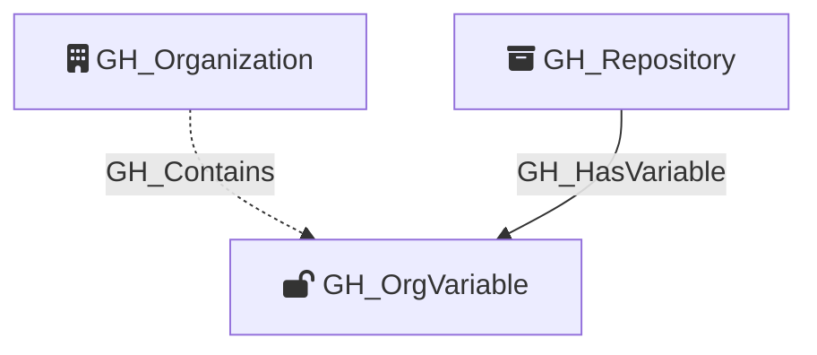

Represents an organization-level GitHub Actions variable. Organization variables can be scoped to all repositories, only private/internal repositories, or a specific set of selected repositories. The visibility property determines how GH_HasVariable edges are resolved to repository nodes. Unlike secrets, variable values are readable via the API.

Created by: `Git-HoundOrganizationSecret`

## Edges

<Note>
The tables below list edges defined by the GitHound extension only. Additional edges to or from this node may be created by other extensions.
</Note>

### Inbound Edges

| Edge Type | Source Node Types | Traversable |
| --------- | ----------------- | ----------- |
| [GH_HasVariable](https://github.com/SpecterOps/bloodhound-docs/blob/main//opengraph/extensions/githound/reference/edges/gh_hasvariable) | [GH_Repository](https://github.com/SpecterOps/bloodhound-docs/blob/main//opengraph/extensions/githound/reference/nodes/gh_repository) | ✅ |

### Outbound Edges

No outbound edges are defined by the GitHound extension for this node.

## Properties

| Property Name    | Data Type | Description                                                                                                                 |
| ---------------- | --------- | --------------------------------------------------------------------------------------------------------------------------- |
| objectid         | string    | A deterministic ID in the format `GH_OrgVariable_{orgNodeId}_{variableName}`.                                               |
| id               | string    | Same as objectid.                                                                                                           |
| name             | string    | The name of the variable.                                                                                                   |
| environment_name | string    | The name of the environment (GitHub organization).                                                                          |
| environmentid    | string    | The node_id of the environment (GitHub organization).                                                                       |
| value            | string    | The plaintext value of the variable.                                                                                        |
| created_at       | datetime  | When the variable was created.                                                                                              |
| updated_at       | datetime  | When the variable was last updated.                                                                                         |
| visibility       | string    | The variable's visibility scope: `all` (all repos), `private` (private and internal repos), or `selected` (specific repos). |

## Diagram

