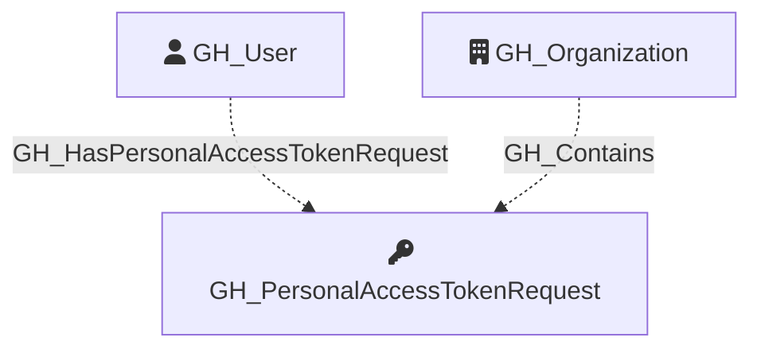

Represents a pending request from an organization member to access organization resources with a fine-grained personal access token. PAT requests are linked to their owning user and the organization. The requested permissions are captured as a JSON string in the properties.

Created by: `Git-HoundPersonalAccessTokenRequest`

## Edges

<Note>
The tables below list edges defined by the GitHound extension only. Additional edges to or from this node may be created by other extensions.
</Note>

### Inbound Edges

| Edge Type | Source Node Types | Traversable |
| --------- | ----------------- | ----------- |
| [GH_Contains](https://github.com/SpecterOps/bloodhound-docs/blob/main//opengraph/extensions/githound/reference/edges/gh_contains) | [GH_Organization](https://github.com/SpecterOps/bloodhound-docs/blob/main//opengraph/extensions/githound/reference/nodes/gh_organization), [GH_Repository](https://github.com/SpecterOps/bloodhound-docs/blob/main//opengraph/extensions/githound/reference/nodes/gh_repository), [GH_Environment](https://github.com/SpecterOps/bloodhound-docs/blob/main//opengraph/extensions/githound/reference/nodes/gh_environment) | ❌ |
| [GH_HasPersonalAccessTokenRequest](https://github.com/SpecterOps/bloodhound-docs/blob/main//opengraph/extensions/githound/reference/edges/gh_haspersonalaccesstokenrequest) | [GH_User](https://github.com/SpecterOps/bloodhound-docs/blob/main//opengraph/extensions/githound/reference/nodes/gh_user) | ❌ |

### Outbound Edges

No outbound edges are defined by the GitHound extension for this node.

## Properties

| Property Name        | Data Type | Description                                                                                   |
| -------------------- | --------- | --------------------------------------------------------------------------------------------- |
| objectid             | string    | Deterministic Base64-encoded identifier, used as the unique graph identifier.                 |
| id                   | string    | The deterministic identifier (same as objectid).                                              |
| name                 | string    | The user-assigned display name of the token.                                                  |
| environment_name     | string    | The name of the environment (GitHub organization) where access is being requested.            |
| environmentid        | string    | The node_id of the environment (GitHub organization).                                         |
| owner_login          | string    | The login handle of the user who submitted the request.                                       |
| owner_id             | integer   | The numeric GitHub ID of the requester.                                                       |
| owner_node_id        | string    | The GraphQL node ID of the requester.                                                         |
| token_id             | integer   | Unique identifier of the user's token, found in audit logs.                                   |
| token_name           | string    | The user-assigned display name of the token.                                                  |
| token_expired        | boolean   | Whether the token has expired.                                                                |
| token_expires_at     | string    | ISO 8601 timestamp of when the token expires.                                                 |
| token_last_used_at   | string    | ISO 8601 timestamp of when the token was last used.                                           |
| repository_selection | string    | Whether the request targets `all`, `subset`, or `none` of the organization's repositories.    |
| reason               | string    | The rationale provided by the requester for the access request.                               |
| created_at           | string    | ISO 8601 timestamp of when the request was submitted.                                         |
| permissions          | string    | JSON string of the permissions being requested (e.g., `{"organization":{},"repository":{}}`). |

## Diagram

