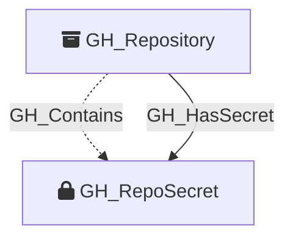

Represents a repository-level GitHub Actions secret. These are secrets defined directly on a specific repository and are only accessible to workflows running in that repository.

Created by: `Git-HoundSecret`

## Edges

<Note>
The tables below list edges defined by the GitHound extension only. Additional edges to or from this node may be created by other extensions.
</Note>

### Inbound Edges

| Edge Type | Source Node Types | Traversable |
| --------- | ----------------- | ----------- |
| [GH_Contains](https://github.com/SpecterOps/bloodhound-docs/blob/main//opengraph/extensions/githound/reference/edges/gh_contains) | [GH_Organization](https://github.com/SpecterOps/bloodhound-docs/blob/main//opengraph/extensions/githound/reference/nodes/gh_organization), [GH_Repository](https://github.com/SpecterOps/bloodhound-docs/blob/main//opengraph/extensions/githound/reference/nodes/gh_repository), [GH_Environment](https://github.com/SpecterOps/bloodhound-docs/blob/main//opengraph/extensions/githound/reference/nodes/gh_environment) | ❌ |
| [GH_HasSecret](https://github.com/SpecterOps/bloodhound-docs/blob/main//opengraph/extensions/githound/reference/edges/gh_hassecret) | [GH_Repository](https://github.com/SpecterOps/bloodhound-docs/blob/main//opengraph/extensions/githound/reference/nodes/gh_repository), [GH_Environment](https://github.com/SpecterOps/bloodhound-docs/blob/main//opengraph/extensions/githound/reference/nodes/gh_environment) | ✅ |

### Outbound Edges

No outbound edges are defined by the GitHound extension for this node.

## Properties

| Property Name    | Data Type | Description                                                            |
| ---------------- | --------- | ---------------------------------------------------------------------- |
| objectid         | string    | A deterministic ID in the format `GHSecret_{repoNodeId}_{secretName}`. |
| id               | string    | Same as objectid.                                                      |
| name             | string    | The name of the secret.                                                |
| environment_name | string    | The name of the environment (GitHub organization).                     |
| environmentid    | string    | The node_id of the environment (GitHub organization).                  |
| repository_name  | string    | The name of the containing repository.                                 |
| repository_id    | string    | The node_id of the containing repository.                              |
| created_at       | datetime  | When the secret was created.                                           |
| updated_at       | datetime  | When the secret was last updated.                                      |
| visibility       | string    | The secret's visibility scope.                                         |

## Diagram

