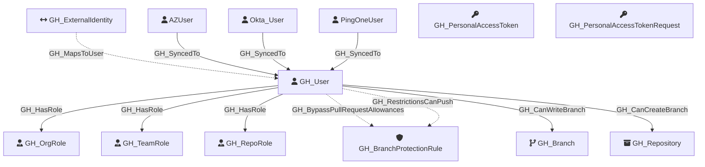

Represents a GitHub user who is a member of the organization. Users are associated with organization roles (Owner or Member) and can be assigned to repository roles and team roles.

Created by: `Git-HoundUser`

## Edges

<Note>
The tables below list edges defined by the GitHound extension only. Additional edges to or from this node may be created by other extensions.
</Note>

### Inbound Edges

| Edge Type | Source Node Types | Traversable |
| --------- | ----------------- | ----------- |
| [GH_Contains](https://github.com/SpecterOps/bloodhound-docs/blob/main//opengraph/extensions/githound/reference/edges/gh_contains) | [GH_Organization](https://github.com/SpecterOps/bloodhound-docs/blob/main//opengraph/extensions/githound/reference/nodes/gh_organization), [GH_Repository](https://github.com/SpecterOps/bloodhound-docs/blob/main//opengraph/extensions/githound/reference/nodes/gh_repository), [GH_Environment](https://github.com/SpecterOps/bloodhound-docs/blob/main//opengraph/extensions/githound/reference/nodes/gh_environment) | ❌ |
| [GH_MapsToUser](https://github.com/SpecterOps/bloodhound-docs/blob/main//opengraph/extensions/githound/reference/edges/gh_mapstouser) | [GH_ExternalIdentity](https://github.com/SpecterOps/bloodhound-docs/blob/main//opengraph/extensions/githound/reference/nodes/gh_externalidentity) | ❌ |
| [GH_SyncedTo](https://github.com/SpecterOps/bloodhound-docs/blob/main//opengraph/extensions/githound/reference/edges/gh_syncedto) | [AZUser](https://github.com/SpecterOps/bloodhound-docs/blob/main//resources/nodes/az-user), [Okta_User](https://github.com/SpecterOps/bloodhound-docs/blob/main//opengraph/extensions/oktahound/reference/nodes/okta_user), [PingOneUser](https://github.com/andyrobbins/PingOneHound?tab=readme-ov-file#schema) | ✅ |
| [GH_ValidToken](https://github.com/SpecterOps/bloodhound-docs/blob/main//opengraph/extensions/githound/reference/edges/gh_validtoken) | [GH_SecretScanningAlert](https://github.com/SpecterOps/bloodhound-docs/blob/main//opengraph/extensions/githound/reference/nodes/gh_secretscanningalert) | ✅ |

### Outbound Edges

| Edge Type | Destination Node Types | Traversable |
| --------- | ---------------------- | ----------- |
| [GH_BypassPullRequestAllowances](https://github.com/SpecterOps/bloodhound-docs/blob/main//opengraph/extensions/githound/reference/edges/gh_bypasspullrequestallowances) | [GH_BranchProtectionRule](https://github.com/SpecterOps/bloodhound-docs/blob/main//opengraph/extensions/githound/reference/nodes/gh_branchprotectionrule) | ❌ |
| [GH_CanCreateBranch](https://github.com/SpecterOps/bloodhound-docs/blob/main//opengraph/extensions/githound/reference/edges/gh_cancreatebranch) | [GH_Repository](https://github.com/SpecterOps/bloodhound-docs/blob/main//opengraph/extensions/githound/reference/nodes/gh_repository) | ✅ |
| [GH_CanWriteBranch](https://github.com/SpecterOps/bloodhound-docs/blob/main//opengraph/extensions/githound/reference/edges/gh_canwritebranch) | [GH_Branch](https://github.com/SpecterOps/bloodhound-docs/blob/main//opengraph/extensions/githound/reference/nodes/gh_branch) | ✅ |
| [GH_HasPersonalAccessToken](https://github.com/SpecterOps/bloodhound-docs/blob/main//opengraph/extensions/githound/reference/edges/gh_haspersonalaccesstoken) | [GH_PersonalAccessToken](https://github.com/SpecterOps/bloodhound-docs/blob/main//opengraph/extensions/githound/reference/nodes/gh_personalaccesstoken) | ❌ |
| [GH_HasPersonalAccessTokenRequest](https://github.com/SpecterOps/bloodhound-docs/blob/main//opengraph/extensions/githound/reference/edges/gh_haspersonalaccesstokenrequest) | [GH_PersonalAccessTokenRequest](https://github.com/SpecterOps/bloodhound-docs/blob/main//opengraph/extensions/githound/reference/nodes/gh_personalaccesstokenrequest) | ❌ |
| [GH_HasRole](https://github.com/SpecterOps/bloodhound-docs/blob/main//opengraph/extensions/githound/reference/edges/gh_hasrole) | [GH_OrgRole](https://github.com/SpecterOps/bloodhound-docs/blob/main//opengraph/extensions/githound/reference/nodes/gh_orgrole), [GH_RepoRole](https://github.com/SpecterOps/bloodhound-docs/blob/main//opengraph/extensions/githound/reference/nodes/gh_reporole), [GH_TeamRole](https://github.com/SpecterOps/bloodhound-docs/blob/main//opengraph/extensions/githound/reference/nodes/gh_teamrole) | ✅ |
| [GH_RestrictionsCanPush](https://github.com/SpecterOps/bloodhound-docs/blob/main//opengraph/extensions/githound/reference/edges/gh_restrictionscanpush) | [GH_BranchProtectionRule](https://github.com/SpecterOps/bloodhound-docs/blob/main//opengraph/extensions/githound/reference/nodes/gh_branchprotectionrule) | ❌ |

## Properties

| Property Name    | Data Type | Description                                                            |
| ---------------- | --------- | ---------------------------------------------------------------------- |
| objectid         | string    | The GitHub `node_id` of the user, used as the unique graph identifier. |
| name             | string    | The user's display name, derived from the login property.              |
| login            | string    | The user's GitHub login handle.                                        |
| company          | string    | The company listed on the user's profile.                              |
| email            | string    | The user's public email address.                                       |
| full_name        | string    | The user's full name from their profile.                               |
| id               | integer   | The numeric GitHub ID of the user.                                     |
| node_id          | string    | The GitHub GraphQL node ID. Redundant with objectid.                   |
| environment_name | string    | The name of the environment (GitHub organization) the user belongs to. |
| environmentid    | string    | The node_id of the environment (GitHub organization).                  |

## Diagram

