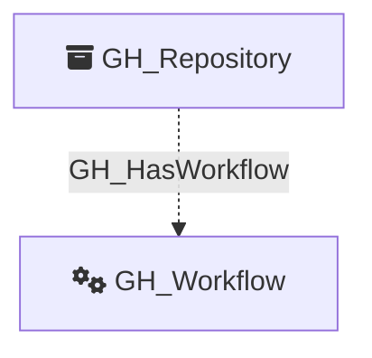

Represents a GitHub Actions workflow defined in a repository. Workflow nodes capture the workflow definition metadata including its file path, state, containing repository, and the full YAML contents of the workflow file. Only repositories with GitHub Actions enabled are queried for workflows.

Created by: `Git-HoundWorkflow`

## Edges

<Note>
The tables below list edges defined by the GitHound extension only. Additional edges to or from this node may be created by other extensions.
</Note>

### Inbound Edges

| Edge Type | Source Node Types | Traversable |
| --------- | ----------------- | ----------- |
| [GH_HasWorkflow](https://github.com/SpecterOps/bloodhound-docs/blob/main//opengraph/extensions/githound/reference/edges/gh_hasworkflow) | [GH_Repository](https://github.com/SpecterOps/bloodhound-docs/blob/main//opengraph/extensions/githound/reference/nodes/gh_repository) | ❌ |

### Outbound Edges

No outbound edges are defined by the GitHound extension for this node.

## Properties

| Property Name    | Data Type | Description                                                                  |
| ---------------- | --------- | ---------------------------------------------------------------------------- |
| objectid         | string    | The GitHub `node_id` of the workflow, used as the unique graph identifier.   |
| name             | string    | The fully qualified workflow name (e.g., `repoName\CI Build`).               |
| short_name       | string    | The workflow's display name.                                                 |
| node_id          | string    | The GitHub GraphQL node ID. Redundant with objectid.                         |
| environment_name | string    | The name of the environment (GitHub organization).                           |
| environmentid    | string    | The node_id of the environment (GitHub organization).                        |
| repository_name  | string    | The full name of the containing repository.                                  |
| repository_id    | string    | The node_id of the containing repository.                                    |
| path             | string    | The file path of the workflow definition (e.g., `.github/workflows/ci.yml`). |
| state            | string    | The workflow state (e.g., `active`, `disabled_manually`).                    |
| url              | string    | The API URL for the workflow.                                                |
| html_url         | string    | The GitHub web URL for the workflow file.                                    |
| branch           | string    | The branch where the workflow file was found.                                |
| contents         | string    | The full YAML contents of the workflow file, downloaded from the repository. |

## Diagram

