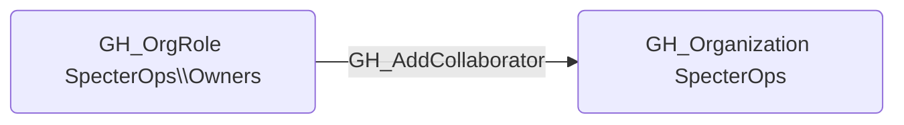

## Edge Schema

- Source: [GH_OrgRole](https://github.com/SpecterOps/bloodhound-docs/blob/main//opengraph/extensions/github/nodes/gh_orgrole)
- Destination: [GH_Organization](https://github.com/SpecterOps/bloodhound-docs/blob/main//opengraph/extensions/github/nodes/gh_organization)
- Traversable: ❌

## General Information

The non-traversable [GH_AddCollaborator](https://github.com/SpecterOps/bloodhound-docs/blob/main//opengraph/extensions/github/edges/gh_addcollaborator) edge represents that a role has the ability to add outside collaborators to organization repositories. This permission is typically restricted to Owners, as it grants repository access to external users who are not members of the organization. Outside collaborators bypass organizational membership controls, making this permission significant for security because it can be used to grant access to untrusted external identities without the visibility that full membership provides.

