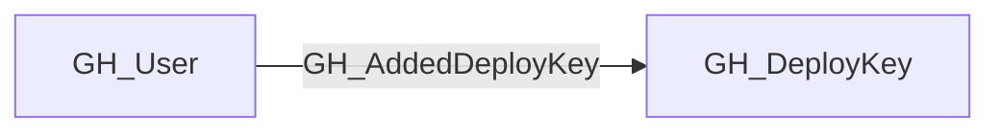
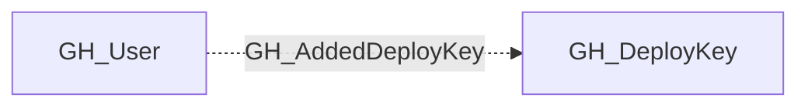

## Edge Schema

- Traversable: ❌

| Start | Kind | End |
|-------|-----------|-------|
| [GH_User](https://github.com/SpecterOps/bloodhound-docs/blob/main//opengraph/extensions/github/nodes/gh_user) | GH_AddedDeployKey | [GH_DeployKey](https://github.com/SpecterOps/bloodhound-docs/blob/main//opengraph/extensions/github/nodes/gh_deploykey) |

## General Information

User added this repository deploy key.

## Edge Schema

| Source | Destination | Traversable |
| --- | --- | --- |
| [GH_User](https://github.com/SpecterOps/bloodhound-docs/blob/main//opengraph/extensions/github/nodes/gh_user) | [GH_DeployKey](https://github.com/SpecterOps/bloodhound-docs/blob/main//opengraph/extensions/github/nodes/gh_deploykey) | `false` |

## Diagram

