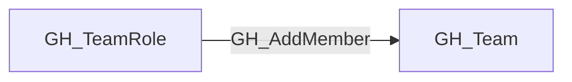
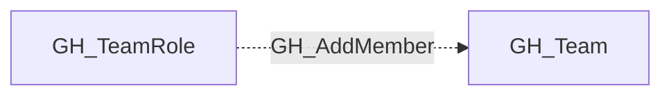

## Edge Schema

- Traversable: ❌

| Start | Kind | End |
|-------|-----------|-------|
| [GH_TeamRole](https://github.com/SpecterOps/bloodhound-docs/blob/main//opengraph/extensions/github/nodes/gh_teamrole) | GH_AddMember | [GH_Team](https://github.com/SpecterOps/bloodhound-docs/blob/main//opengraph/extensions/github/nodes/gh_team) |

## General Information

The non-traversable GH_AddMember edge indicates that a team role with the Maintainer permission level can add new members to the team. Maintainers already inherit the team's repository permissions through [GH_MemberOf](https://github.com/SpecterOps/bloodhound-docs/blob/main//opengraph/extensions/github/edges/gh_memberof), so this edge preserves the membership-management capability as context without creating a second access path to the same team.

## Edge Schema

| Source | Destination | Traversable |
| --- | --- | --- |
| [GH_TeamRole](https://github.com/SpecterOps/bloodhound-docs/blob/main//opengraph/extensions/github/nodes/gh_teamrole) | [GH_Team](https://github.com/SpecterOps/bloodhound-docs/blob/main//opengraph/extensions/github/nodes/gh_team) | `false` |

## Diagram

