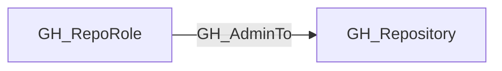

## Edge Schema

- Traversable: ✅

| Start | Kind | End |
|-------|-----------|-------|
| [GH_RepoRole](https://github.com/SpecterOps/bloodhound-docs/blob/main//opengraph/extensions/github/nodes/gh_reporole) | GH_AdminTo | [GH_Repository](https://github.com/SpecterOps/bloodhound-docs/blob/main//opengraph/extensions/github/nodes/gh_repository) |

## General Information

The traversable GH_AdminTo edge represents a role's full administrative access to the repository. Admin is the highest built-in repository role and grants control over all repository settings, including dangerous operations like deleting the repository or modifying its visibility. Admin access bypasses most protections including branch protection rules, unless `enforce_admins` is explicitly enabled on the branch protection rule. This edge is a key permission in the computed branch access model and is a high-value target in attack path analysis.

## Edge Schema

| Source | Destination | Traversable |
| --- | --- | --- |
| [GH_RepoRole](https://github.com/SpecterOps/bloodhound-docs/blob/main//opengraph/extensions/github/nodes/gh_reporole) | [GH_Repository](https://github.com/SpecterOps/bloodhound-docs/blob/main//opengraph/extensions/github/nodes/gh_repository) | `true` |

## Diagram

