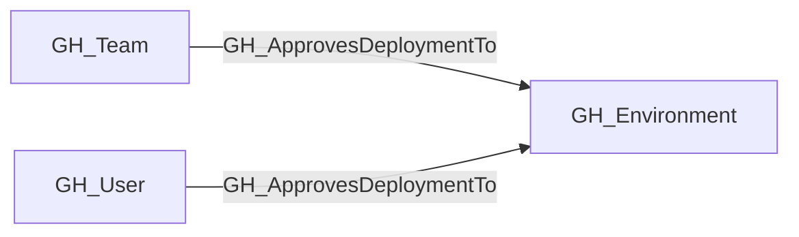
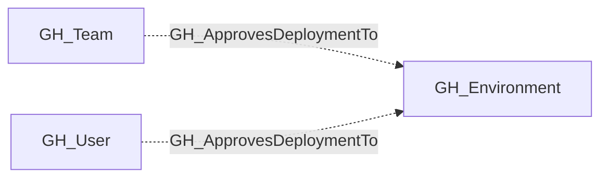

## Edge Schema

- Traversable: ❌

| Start | Kind | End |
|-------|-----------|-------|
| [GH_User](https://github.com/SpecterOps/bloodhound-docs/blob/main//opengraph/extensions/github/nodes/gh_user) | GH_ApprovesDeploymentTo | [GH_Environment](https://github.com/SpecterOps/bloodhound-docs/blob/main//opengraph/extensions/github/nodes/gh_environment) |
| [GH_Team](https://github.com/SpecterOps/bloodhound-docs/blob/main//opengraph/extensions/github/nodes/gh_team) | GH_ApprovesDeploymentTo | [GH_Environment](https://github.com/SpecterOps/bloodhound-docs/blob/main//opengraph/extensions/github/nodes/gh_environment) |

## General Information

The non-traversable GH_ApprovesDeploymentTo edge represents that a user or team is configured as a required reviewer for a GitHub Environment.

This edge is emitted from [GH_User](https://github.com/SpecterOps/bloodhound-docs/blob/main//opengraph/extensions/github/nodes/gh_user) or [GH_Team](https://github.com/SpecterOps/bloodhound-docs/blob/main//opengraph/extensions/github/nodes/gh_team) nodes to [GH_Environment](https://github.com/SpecterOps/bloodhound-docs/blob/main//opengraph/extensions/github/nodes/gh_environment) nodes when the environment includes a required reviewer protection rule. Required reviewers act as an approval gate before jobs referencing the environment can continue.

The edge is non-traversable because it records reviewer configuration rather than direct deployment access. When self-review is allowed, the same reviewer may also receive a traversable [GH_CanDeployToEnvironment](https://github.com/SpecterOps/bloodhound-docs/blob/main//opengraph/extensions/github/edges/gh_candeploytoenvironment) edge only if they can also supply deployable code through [GH_CanCreateBranch](https://github.com/SpecterOps/bloodhound-docs/blob/main//opengraph/extensions/github/edges/gh_cancreatebranch) or [GH_CanWriteBranch](https://github.com/SpecterOps/bloodhound-docs/blob/main//opengraph/extensions/github/edges/gh_canwritebranch) under the environment's branch policy. When prevent_self_review is enabled, GH_ApprovesDeploymentTo remains context only because the split-principal approval flow is not currently modeled.

## Edge Schema

| Source | Destination | Traversable |
| --- | --- | --- |
| [GH_Team](https://github.com/SpecterOps/bloodhound-docs/blob/main//opengraph/extensions/github/nodes/gh_team) | [GH_Environment](https://github.com/SpecterOps/bloodhound-docs/blob/main//opengraph/extensions/github/nodes/gh_environment) | `false` |
| [GH_User](https://github.com/SpecterOps/bloodhound-docs/blob/main//opengraph/extensions/github/nodes/gh_user) | [GH_Environment](https://github.com/SpecterOps/bloodhound-docs/blob/main//opengraph/extensions/github/nodes/gh_environment) | `false` |

## Diagram

