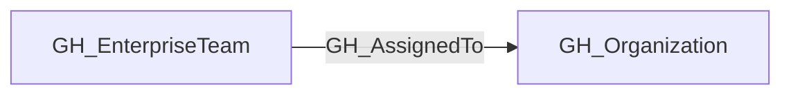
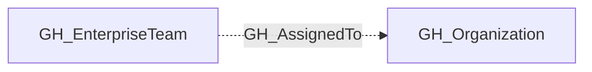

## Edge Schema

- Traversable: ❌

| Start | Kind | End |
|-------|-----------|-------|
| [GH_EnterpriseTeam](https://github.com/SpecterOps/bloodhound-docs/blob/main//opengraph/extensions/github/nodes/gh_enterpriseteam) | GH_AssignedTo | [GH_Organization](https://github.com/SpecterOps/bloodhound-docs/blob/main//opengraph/extensions/github/nodes/gh_organization) |

## General Information

The non-traversable GH_AssignedTo edge represents an enterprise-scoped team being assigned to an organization.

This edge is not traversable because assignment alone does not directly grant a principal a privilege path.

## Edge Schema

| Source | Destination | Traversable |
| --- | --- | --- |
| [GH_EnterpriseTeam](https://github.com/SpecterOps/bloodhound-docs/blob/main//opengraph/extensions/github/nodes/gh_enterpriseteam) | [GH_Organization](https://github.com/SpecterOps/bloodhound-docs/blob/main//opengraph/extensions/github/nodes/gh_organization) | `false` |

## Diagram

