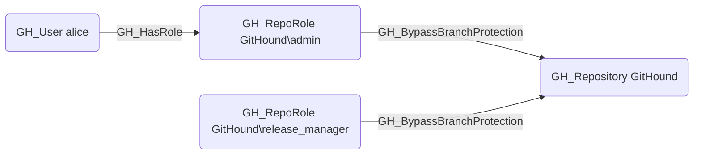

## Edge Schema

- Source: [GH_RepoRole](https://github.com/SpecterOps/bloodhound-docs/blob/main//opengraph/extensions/github/nodes/gh_reporole)
- Destination: [GH_Repository](https://github.com/SpecterOps/bloodhound-docs/blob/main//opengraph/extensions/github/nodes/gh_repository)
- Traversable: ❌

## General Information

The non-traversable [GH_BypassBranchProtection](https://github.com/SpecterOps/bloodhound-docs/blob/main//opengraph/extensions/github/edges/gh_bypassbranchprotection) edge represents a role's ability to bypass branch protection rules on the repository. This permission is available to Admin roles and custom roles that have been granted this specific permission. Bypassing branch protection allows merging pull requests without satisfying required review or status check requirements, effectively circumventing the merge gate. This bypass is suppressed when `enforce_admins` is enabled on the branch protection rule, which forces even admins to comply with the protection policy.

