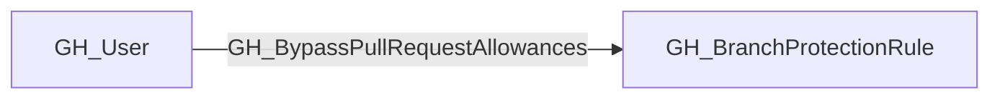
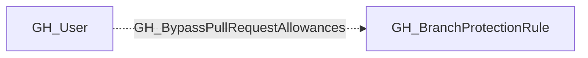

## Edge Schema

- Traversable: ❌

| Start | Kind | End |
|-------|-----------|-------|
| [GH_User](https://github.com/SpecterOps/bloodhound-docs/blob/main//opengraph/extensions/github/nodes/gh_user) | GH_BypassPullRequestAllowances | [GH_BranchProtectionRule](https://github.com/SpecterOps/bloodhound-docs/blob/main//opengraph/extensions/github/nodes/gh_branchprotectionrule) |

## General Information

The non-traversable GH_BypassPullRequestAllowances edge represents a per-actor allowance that bypasses the pull request review requirement on a branch protection rule. This edge identifies specific users or teams that can merge code without going through the normal PR review process. This is a significant security concern because these actors can push or merge changes directly, circumventing code review controls that protect branch integrity. Note that this bypass is suppressed when `enforce_admins` is enabled on the branch protection rule, meaning even listed actors must follow the PR review requirement.

## Edge Schema

| Source | Destination | Traversable |
| --- | --- | --- |
| [GH_User](https://github.com/SpecterOps/bloodhound-docs/blob/main//opengraph/extensions/github/nodes/gh_user) | [GH_BranchProtectionRule](https://github.com/SpecterOps/bloodhound-docs/blob/main//opengraph/extensions/github/nodes/gh_branchprotectionrule) | `false` |

## Diagram

