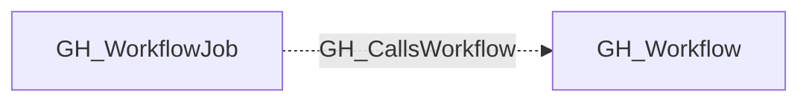

## Edge Schema

- Traversable: ❌

| Start | Kind | End |
|-------|-----------|-------|
| [GH_WorkflowJob](https://github.com/SpecterOps/bloodhound-docs/blob/main//opengraph/extensions/github/nodes/gh_workflowjob) | GH_CallsWorkflow | [GH_Workflow](https://github.com/SpecterOps/bloodhound-docs/blob/main//opengraph/extensions/github/nodes/gh_workflow) |

## General Information

The traversable GH_CallsWorkflow edge links a workflow job to a reusable workflow it invokes via the `uses:` key at the job level. This edge captures the reusable workflow call graph, enabling analysts to trace inherited permissions and secret access through called workflows.

### Local vs. remote reusable workflows

- **Local** (`./. github/workflows/_ci.yml`): the destination is matched by `name` against workflows in the same repository.
- **Remote** (`org/repo/.github/workflows/file.yml@ref`): the destination is matched by the full reference string. If the called workflow has not been collected, the edge destination will not resolve.

The `reusable_ref` property on the edge always contains the raw `uses:` value from the workflow file.

## Edge Schema

| Source | Destination | Traversable |
| --- | --- | --- |
| [GH_WorkflowJob](https://github.com/SpecterOps/bloodhound-docs/blob/main//opengraph/extensions/github/nodes/gh_workflowjob) | [GH_Workflow](https://github.com/SpecterOps/bloodhound-docs/blob/main//opengraph/extensions/github/nodes/gh_workflow) | `false` |

## Diagram

