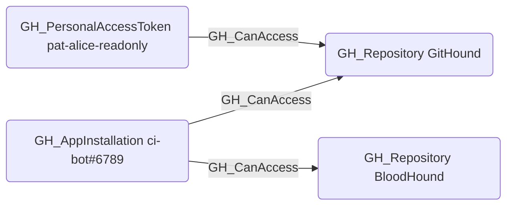

## Edge Schema

- Source: [GH_PersonalAccessToken](https://github.com/SpecterOps/bloodhound-docs/blob/main//opengraph/extensions/github/nodes/gh_personalaccesstoken), [GH_AppInstallation](https://github.com/SpecterOps/bloodhound-docs/blob/main//opengraph/extensions/github/nodes/gh_appinstallation)
- Destination: [GH_Repository](https://github.com/SpecterOps/bloodhound-docs/blob/main//opengraph/extensions/github/nodes/gh_repository)
- Traversable: ❌

## General Information

The non-traversable [GH_CanAccess](https://github.com/SpecterOps/bloodhound-docs/blob/main//opengraph/extensions/github/edges/gh_canaccess) edge indicates that a personal access token or app installation has been granted access to specific repositories. It is created by `Git-HoundPersonalAccessToken` and `Git-HoundPersonalAccessTokenRequest` for PATs, and by `Git-HoundAppInstallation` for app installations. This edge represents the scope of access granted to a token or app rather than a direct attack path, providing visibility into which repositories are reachable through non-human credentials. It is non-traversable because token and app access does not transitively extend to other principals.

