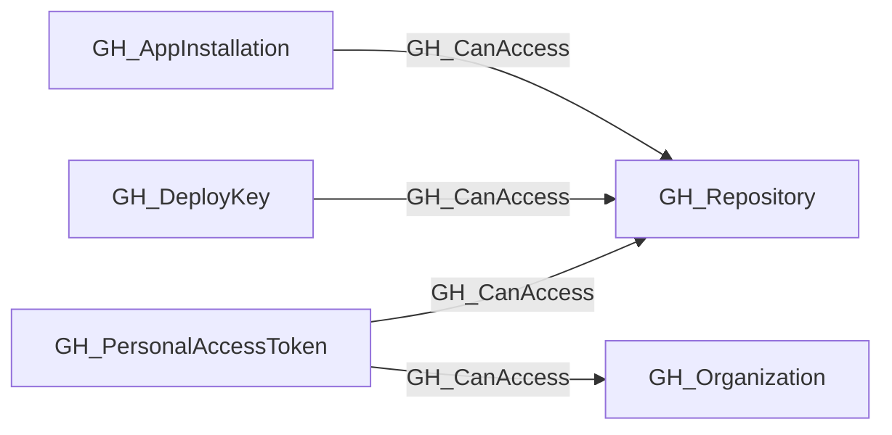
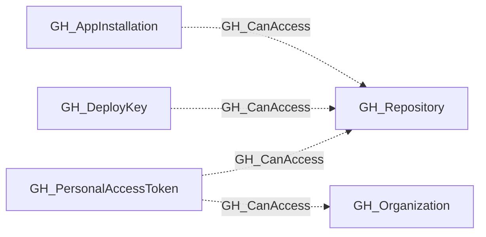

## Edge Schema

- Traversable: ❌

| Start | Kind | End |
|-------|-----------|-------|
| [GH_DeployKey](https://github.com/SpecterOps/bloodhound-docs/blob/main//opengraph/extensions/github/nodes/gh_deploykey) | GH_CanAccess | [GH_Repository](https://github.com/SpecterOps/bloodhound-docs/blob/main//opengraph/extensions/github/nodes/gh_repository) |
| [GH_PersonalAccessToken](https://github.com/SpecterOps/bloodhound-docs/blob/main//opengraph/extensions/github/nodes/gh_personalaccesstoken) | GH_CanAccess | [GH_Organization](https://github.com/SpecterOps/bloodhound-docs/blob/main//opengraph/extensions/github/nodes/gh_organization) |
| [GH_AppInstallation](https://github.com/SpecterOps/bloodhound-docs/blob/main//opengraph/extensions/github/nodes/gh_appinstallation) | GH_CanAccess | [GH_Repository](https://github.com/SpecterOps/bloodhound-docs/blob/main//opengraph/extensions/github/nodes/gh_repository) |
| [GH_PersonalAccessToken](https://github.com/SpecterOps/bloodhound-docs/blob/main//opengraph/extensions/github/nodes/gh_personalaccesstoken) | GH_CanAccess | [GH_Repository](https://github.com/SpecterOps/bloodhound-docs/blob/main//opengraph/extensions/github/nodes/gh_repository) |

```mermaid
flowchart LR
    GH_AppInstallation["GH_AppInstallation"]
    GH_DeployKey["GH_DeployKey"]
    GH_Organization["GH_Organization"]
    GH_PersonalAccessToken["GH_PersonalAccessToken"]
    GH_Repository["GH_Repository"]
    GH_AppInstallation -- GH_CanAccess --> GH_Repository
    GH_DeployKey -- GH_CanAccess --> GH_Repository
    GH_PersonalAccessToken -- GH_CanAccess --> GH_Organization
    GH_PersonalAccessToken -- GH_CanAccess --> GH_Repository
```

## General Information

The non-traversable GH_CanAccess edge indicates that a personal access token, app installation, or deploy key has been granted access to a repository or organization. This edge represents the scope of access granted to a non-human credential rather than a direct attack path, providing visibility into which repositories are reachable through that credential. It is non-traversable because credential access does not transitively extend to other principals.

## Edge Schema

| Source | Destination | Traversable |
| --- | --- | --- |
| [GH_AppInstallation](https://github.com/SpecterOps/bloodhound-docs/blob/main//opengraph/extensions/github/nodes/gh_appinstallation) | [GH_Repository](https://github.com/SpecterOps/bloodhound-docs/blob/main//opengraph/extensions/github/nodes/gh_repository) | `false` |
| [GH_DeployKey](https://github.com/SpecterOps/bloodhound-docs/blob/main//opengraph/extensions/github/nodes/gh_deploykey) | [GH_Repository](https://github.com/SpecterOps/bloodhound-docs/blob/main//opengraph/extensions/github/nodes/gh_repository) | `false` |
| [GH_PersonalAccessToken](https://github.com/SpecterOps/bloodhound-docs/blob/main//opengraph/extensions/github/nodes/gh_personalaccesstoken) | [GH_Organization](https://github.com/SpecterOps/bloodhound-docs/blob/main//opengraph/extensions/github/nodes/gh_organization) | `false` |
| [GH_PersonalAccessToken](https://github.com/SpecterOps/bloodhound-docs/blob/main//opengraph/extensions/github/nodes/gh_personalaccesstoken) | [GH_Repository](https://github.com/SpecterOps/bloodhound-docs/blob/main//opengraph/extensions/github/nodes/gh_repository) | `false` |

## Diagram

```mermaid
graph LR
    n0["GH_AppInstallation"]
    n1["GH_Repository"]
    n2["GH_DeployKey"]
    n3["GH_PersonalAccessToken"]
    n4["GH_Organization"]
    n0 -.->|GH_CanAccess| n1
    n2 -.->|GH_CanAccess| n1
    n3 -.->|GH_CanAccess| n4
    n3 -.->|GH_CanAccess| n1
```
