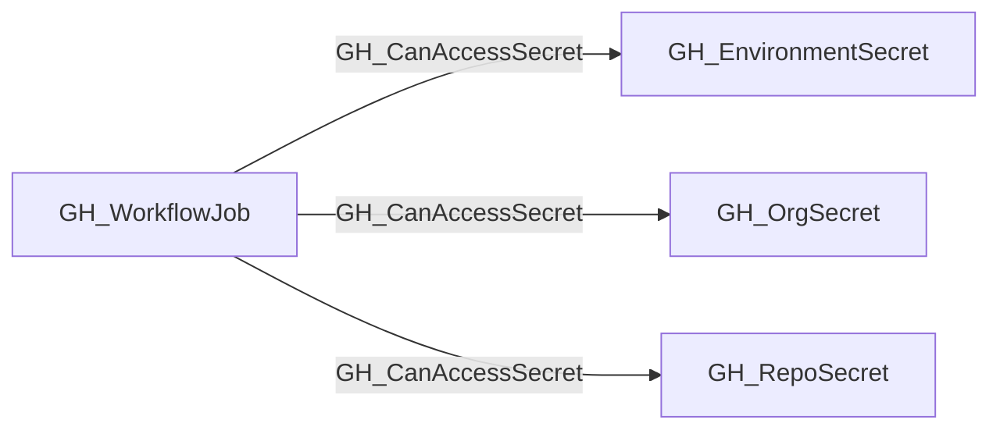

## Edge Schema

- Traversable: ✅

| Start | Kind | End |
|-------|-----------|-------|
| [GH_WorkflowJob](https://github.com/SpecterOps/bloodhound-docs/blob/main//opengraph/extensions/github/nodes/gh_workflowjob) | GH_CanAccessSecret | [GH_RepoSecret](https://github.com/SpecterOps/bloodhound-docs/blob/main//opengraph/extensions/github/nodes/gh_reposecret) |
| [GH_WorkflowJob](https://github.com/SpecterOps/bloodhound-docs/blob/main//opengraph/extensions/github/nodes/gh_workflowjob) | GH_CanAccessSecret | [GH_OrgSecret](https://github.com/SpecterOps/bloodhound-docs/blob/main//opengraph/extensions/github/nodes/gh_orgsecret) |
| [GH_WorkflowJob](https://github.com/SpecterOps/bloodhound-docs/blob/main//opengraph/extensions/github/nodes/gh_workflowjob) | GH_CanAccessSecret | [GH_EnvironmentSecret](https://github.com/SpecterOps/bloodhound-docs/blob/main//opengraph/extensions/github/nodes/gh_environmentsecret) |

## General Information

The traversable GH_CanAccessSecret edge represents that a GitHub Actions workflow job execution context can access a statically referenced secret.

This edge is derived from the existing non-traversable [GH_UsesSecret](https://github.com/SpecterOps/bloodhound-docs/blob/main//opengraph/extensions/github/edges/gh_usessecret) relationships on the job's contained steps and from job-level `env` declarations. It is intended for attack-path analysis from a compromised job execution context to the secrets that context can read.

The collector only emits this edge when one of the workflow job's modeled steps or the job's `env` block statically references the secret. The existence of a secret in the repository, organization, or environment scope alone is not enough. For this initial implementation, secrets passed through `jobs.<job_id>.secrets` to reusable workflows are retained as structural references but are not projected as runtime access for the caller job.

## Edge Schema

| Source | Destination | Traversable |
| --- | --- | --- |
| [GH_WorkflowJob](https://github.com/SpecterOps/bloodhound-docs/blob/main//opengraph/extensions/github/nodes/gh_workflowjob) | [GH_EnvironmentSecret](https://github.com/SpecterOps/bloodhound-docs/blob/main//opengraph/extensions/github/nodes/gh_environmentsecret) | `true` |
| [GH_WorkflowJob](https://github.com/SpecterOps/bloodhound-docs/blob/main//opengraph/extensions/github/nodes/gh_workflowjob) | [GH_OrgSecret](https://github.com/SpecterOps/bloodhound-docs/blob/main//opengraph/extensions/github/nodes/gh_orgsecret) | `true` |
| [GH_WorkflowJob](https://github.com/SpecterOps/bloodhound-docs/blob/main//opengraph/extensions/github/nodes/gh_workflowjob) | [GH_RepoSecret](https://github.com/SpecterOps/bloodhound-docs/blob/main//opengraph/extensions/github/nodes/gh_reposecret) | `true` |

## Diagram

