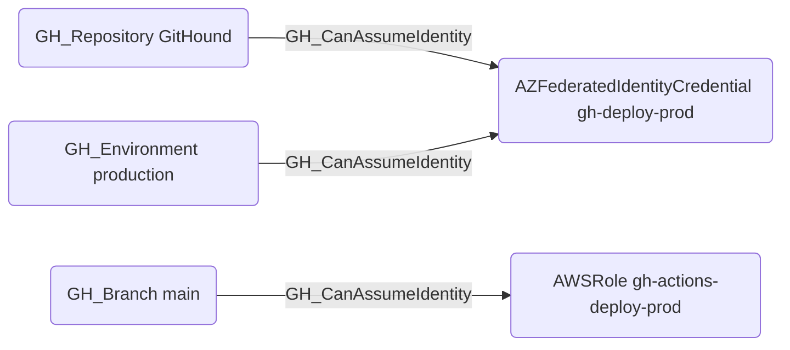

## Edge Schema

- Source: [GH_Repository](https://github.com/SpecterOps/bloodhound-docs/blob/main//opengraph/extensions/github/nodes/gh_repository), [GH_Branch](https://github.com/SpecterOps/bloodhound-docs/blob/main//opengraph/extensions/github/nodes/gh_branch), [GH_Environment](https://github.com/SpecterOps/bloodhound-docs/blob/main//opengraph/extensions/github/nodes/gh_environment)
- Destination: [AZFederatedIdentityCredential](https://github.com/SpecterOps/bloodhound-docs/blob/main//resources/nodes/az-federated-identity-credential), `AWSRole`
- Traversable: ✅

## General Information

The traversable [GH_CanAssumeIdentity](https://github.com/SpecterOps/bloodhound-docs/blob/main//opengraph/extensions/github/edges/gh_canassumeidentity) edge is a hybrid edge connecting GitHub OIDC token sources to cloud identity targets configured for GitHub Actions federation. Created by the collector when matching GitHub OIDC subject claims to cloud workload identity federation configurations, this edge represents a verified path from GitHub Actions to cloud resource access. It is traversable because an attacker who can execute workflows in the source repository, branch, or environment can obtain an OIDC token that the cloud provider will accept, granting access to the associated cloud identity and its permissions. This edge is critical for identifying cross-cloud lateral movement paths from GitHub into Azure and AWS.

