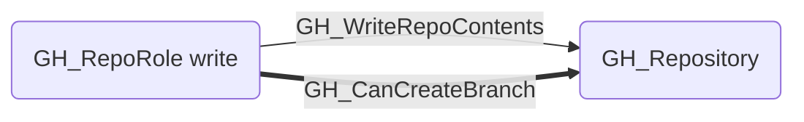
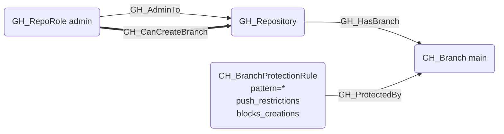
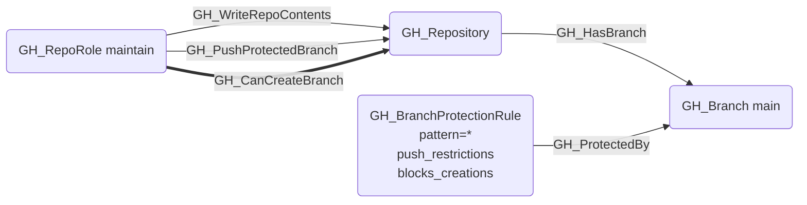
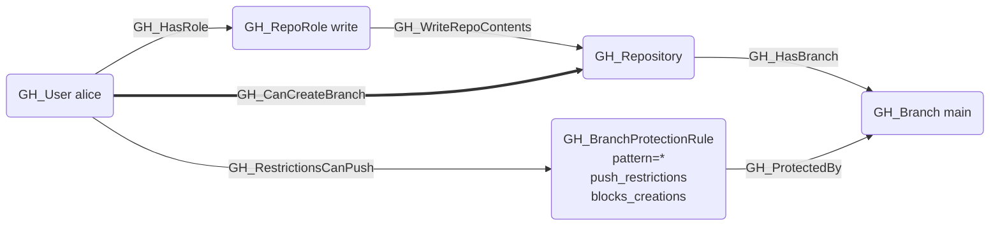

## Edge Schema

- Source: [GH_RepoRole](https://github.com/SpecterOps/bloodhound-docs/blob/main//opengraph/extensions/github/nodes/gh_reporole), [GH_User](https://github.com/SpecterOps/bloodhound-docs/blob/main//opengraph/extensions/github/nodes/gh_user), [GH_Team](https://github.com/SpecterOps/bloodhound-docs/blob/main//opengraph/extensions/github/nodes/gh_team)
- Destination: [GH_Repository](https://github.com/SpecterOps/bloodhound-docs/blob/main//opengraph/extensions/github/nodes/gh_repository)
- Traversable: ✅

## General Information

The traversable GH_CanCreateBranch edge is a computed edge indicating that a role or actor can create new branches in a repository. The computation evaluates whether a wildcard (`*`) BPR with push restrictions and `blocks_creations` exists. If no such BPR exists, any write-capable role can create branches. If one exists, admin or `push_protected_branch` permission is required, or the actor must be listed in pushAllowances. Per-actor edges from [GH_User](https://github.com/SpecterOps/bloodhound-docs/blob/main//opengraph/extensions/github/nodes/gh_user) or [GH_Team](https://github.com/SpecterOps/bloodhound-docs/blob/main//opengraph/extensions/github/nodes/gh_team) are only emitted when BPR allowances grant branch creation access beyond what the role provides. Each edge includes a `reason` property and a `query_composition` Cypher query showing the underlying graph evidence.
## Scenarios

### `no_protection` — No wildcard BPR blocking creations

No wildcard (`*`) BPR with `blocks_creations` exists. Any write-capable role can create new branches.

### `admin` — Admin bypasses wildcard BPR

A wildcard BPR with `push_restrictions` and `blocks_creations` prevents branch creation. The admin role bypasses this restriction.

### `push_protected_branch` — Push-protected role bypasses wildcard BPR

A wildcard BPR blocks creations. The [GH_PushProtectedBranch](https://github.com/SpecterOps/bloodhound-docs/blob/main//opengraph/extensions/github/edges/gh_pushprotectedbranch) permission bypasses the push gate regardless of `enforce_admins`.

### `push_allowance` — Per-actor push restriction bypass

User or Team listed in the wildcard BPR's `pushAllowances` can create branches. This is a per-actor delta edge — only emitted when the actor's role doesn't already grant [GH_CanCreateBranch](https://github.com/SpecterOps/bloodhound-docs/blob/main//opengraph/extensions/github/edges/gh_cancreatebranch).

