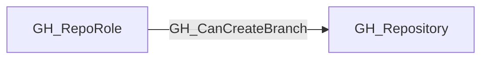
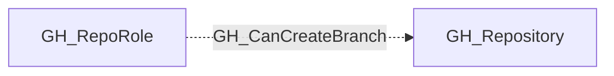

## Edge Schema

- Traversable: ✅

| Start | Kind | End |
|-------|-----------|-------|
| [GH_RepoRole](https://github.com/SpecterOps/bloodhound-docs/blob/main//opengraph/extensions/github/nodes/gh_reporole) | GH_CanCreateBranch | [GH_Repository](https://github.com/SpecterOps/bloodhound-docs/blob/main//opengraph/extensions/github/nodes/gh_repository) |

```mermaid
flowchart LR
    GH_RepoRole["GH_RepoRole"]
    GH_Repository["GH_Repository"]
    GH_RepoRole -- GH_CanCreateBranch --> GH_Repository
```

## General Information

The traversable GH_CanCreateBranch edge is a computed edge indicating that a role or actor can create new branches in a repository. The computation evaluates whether a wildcard (`*`) BPR with push restrictions and `blocks_creations` exists. If no such BPR exists, any write-capable role can create branches. If one exists, admin or `push_protected_branch` permission is required, or the actor must be listed in pushAllowances. Per-actor edges from [GH_User](https://github.com/SpecterOps/bloodhound-docs/blob/main//opengraph/extensions/github/nodes/gh_user) or [GH_Team](https://github.com/SpecterOps/bloodhound-docs/blob/main//opengraph/extensions/github/nodes/gh_team) are only emitted when BPR allowances grant branch creation access beyond what the role provides. Each edge includes a `reason` property and a `query_composition` Cypher query showing the underlying graph evidence.

## Scenarios

### `no_protection` — No wildcard BPR blocking creations

No wildcard (`*`) BPR with `blocks_creations` exists. Any write-capable role can create new branches.

## Edge Schema

| Source | Destination | Traversable |
| --- | --- | --- |
| [GH_RepoRole](https://github.com/SpecterOps/bloodhound-docs/blob/main//opengraph/extensions/github/nodes/gh_reporole) | [GH_Repository](https://github.com/SpecterOps/bloodhound-docs/blob/main//opengraph/extensions/github/nodes/gh_repository) | `false` |

## Diagram

```mermaid
graph LR
    n0["GH_RepoRole"]
    n1["GH_Repository"]
    n0 -.->|GH_CanCreateBranch| n1
```
