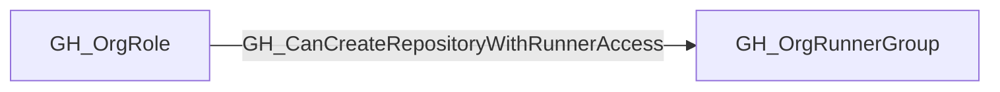

## Edge Schema

- Traversable: ✅

| Start | Kind | End |
|-------|-----------|-------|
| [GH_OrgRole](https://github.com/SpecterOps/bloodhound-docs/blob/main//opengraph/extensions/github/nodes/gh_orgrole) | GH_CanCreateRepositoryWithRunnerAccess | [GH_OrgRunnerGroup](https://github.com/SpecterOps/bloodhound-docs/blob/main//opengraph/extensions/github/nodes/gh_orgrunnergroup) |

## General Information

The traversable GH_CanCreateRepositoryWithRunnerAccess edge is a computed edge indicating that a [GH_OrgRole](https://github.com/SpecterOps/bloodhound-docs/blob/main//opengraph/extensions/github/nodes/gh_orgrole) can create a repository that will immediately be able to dispatch workflows to a [GH_OrgRunnerGroup](https://github.com/SpecterOps/bloodhound-docs/blob/main//opengraph/extensions/github/nodes/gh_orgrunnergroup).

This edge is emitted only for runner groups with `visibility=all` or `visibility=private`. Groups with `visibility=selected` require explicit repository assignment, so creating a repository does not automatically grant access to the group. For `visibility=all`, public repository creation is included only when `allows_public_repositories=true`; otherwise the composition is limited to private and internal repository creation.

The collector emits this edge only when new repositories in the organization have GitHub Actions enabled by default (`actions_enabled_repositories=all`), the organization-facing runner group has `restricted_to_workflows=false`, and inherited enterprise-backed access also has `restricted_to_workflows=false` on the source [GH_EnterpriseRunnerGroup](https://github.com/SpecterOps/bloodhound-docs/blob/main//opengraph/extensions/github/nodes/gh_enterpriserunnergroup).

The computation follows repository-creation capability edges from the org role to the organization and then [GH_Contains](https://github.com/SpecterOps/bloodhound-docs/blob/main//opengraph/extensions/github/edges/gh_contains) to the runner group. Each edge includes a `query_composition` Cypher query showing the repository-creation path and the Actions and runner-group policy predicates that make the path immediately usable.

## Edge Schema

| Source | Destination | Traversable |
| --- | --- | --- |
| [GH_OrgRole](https://github.com/SpecterOps/bloodhound-docs/blob/main//opengraph/extensions/github/nodes/gh_orgrole) | [GH_OrgRunnerGroup](https://github.com/SpecterOps/bloodhound-docs/blob/main//opengraph/extensions/github/nodes/gh_orgrunnergroup) | `true` |

## Diagram

