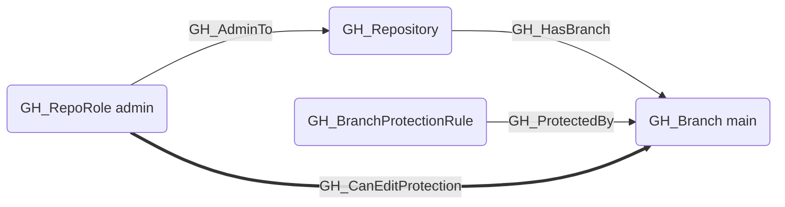
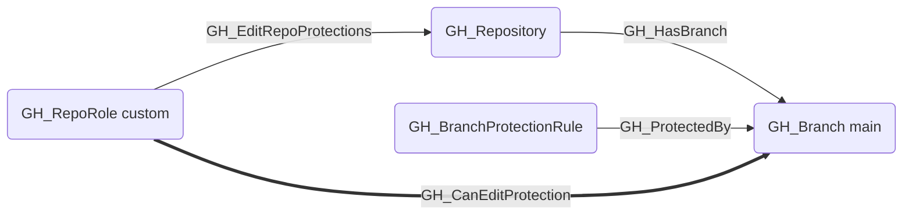

## Edge Schema

- Source: [GH_RepoRole](https://github.com/SpecterOps/bloodhound-docs/blob/main//opengraph/extensions/github/nodes/gh_reporole)
- Destination: [GH_Branch](https://github.com/SpecterOps/bloodhound-docs/blob/main//opengraph/extensions/github/nodes/gh_branch)
- Traversable: ✅

## General Information

The traversable GH_CanEditProtection edge is a computed edge indicating that a role can modify or remove the branch protection rules governing a specific branch. This edge is emitted when the role has [GH_EditRepoProtections](https://github.com/SpecterOps/bloodhound-docs/blob/main//opengraph/extensions/github/edges/gh_editrepoprotections) or [GH_AdminTo](https://github.com/SpecterOps/bloodhound-docs/blob/main//opengraph/extensions/github/edges/gh_adminto) permissions and the branch is covered by at least one branch protection rule. The edge targets the protected branch (not the BPR itself) because the security impact is evaluated per-branch — a role that can weaken or remove protections on a branch can subsequently push code to it, representing a privilege escalation path.
## Scenarios

### `admin` — Admin can edit protections

The admin role has [GH_AdminTo](https://github.com/SpecterOps/bloodhound-docs/blob/main//opengraph/extensions/github/edges/gh_adminto) which implicitly grants the ability to modify or remove any branch protection rule.

### `edit_repo_protections` — Explicit edit permission

A custom or standard role with the [GH_EditRepoProtections](https://github.com/SpecterOps/bloodhound-docs/blob/main//opengraph/extensions/github/edges/gh_editrepoprotections) permission can modify or remove branch protection rules.

