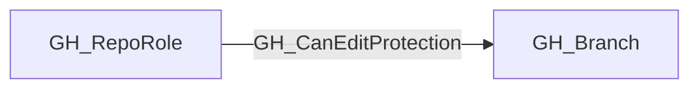
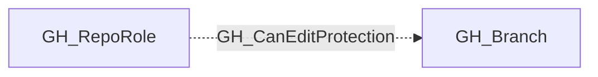

## Edge Schema

- Traversable: ✅

| Start | Kind | End |
|-------|-----------|-------|
| [GH_RepoRole](https://github.com/SpecterOps/bloodhound-docs/blob/main//opengraph/extensions/github/nodes/gh_reporole) | GH_CanEditProtection | [GH_Branch](https://github.com/SpecterOps/bloodhound-docs/blob/main//opengraph/extensions/github/nodes/gh_branch) |

```mermaid
flowchart LR
    GH_Branch["GH_Branch"]
    GH_RepoRole["GH_RepoRole"]
    GH_RepoRole -- GH_CanEditProtection --> GH_Branch
```

## General Information

The traversable GH_CanEditProtection edge is a computed edge indicating that a role can modify or remove branch protection rules in a repository. This edge is emitted when the role has [GH_EditRepoProtections](https://github.com/SpecterOps/bloodhound-docs/blob/main//opengraph/extensions/github/edges/gh_editrepoprotections) or [GH_AdminTo](https://github.com/SpecterOps/bloodhound-docs/blob/main//opengraph/extensions/github/edges/gh_adminto) permissions and the repository contains at least one protected branch. Repo-targeted edges model the repo-wide security impact for attack path traversal; branch-targeted edges are also emitted as supporting evidence for each protected branch governed by those rules.

## Scenarios

### `admin` — Admin can edit protections

The admin role has [GH_AdminTo](https://github.com/SpecterOps/bloodhound-docs/blob/main//opengraph/extensions/github/edges/gh_adminto) which implicitly grants the ability to modify or remove any branch protection rule.

## Edge Schema

| Source | Destination | Traversable |
| --- | --- | --- |
| [GH_RepoRole](https://github.com/SpecterOps/bloodhound-docs/blob/main//opengraph/extensions/github/nodes/gh_reporole) | [GH_Branch](https://github.com/SpecterOps/bloodhound-docs/blob/main//opengraph/extensions/github/nodes/gh_branch) | `false` |

## Diagram

```mermaid
graph LR
    n0["GH_RepoRole"]
    n1["GH_Branch"]
    n0 -.->|GH_CanEditProtection| n1
```
