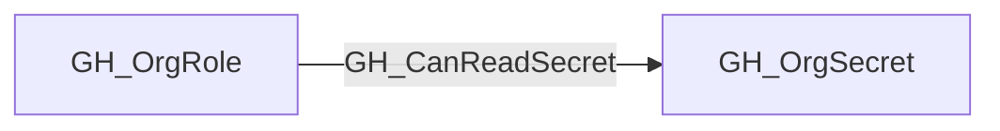

## Edge Schema

- Traversable: ✅

| Start | Kind | End |
|-------|-----------|-------|
| [GH_OrgRole](https://github.com/SpecterOps/bloodhound-docs/blob/main//opengraph/extensions/github/nodes/gh_orgrole) | GH_CanReadSecret | [GH_OrgSecret](https://github.com/SpecterOps/bloodhound-docs/blob/main//opengraph/extensions/github/nodes/gh_orgsecret) |

## General Information

Org role can read an organization secret by creating a repository in scope.

## Edge Schema

| Source | Destination | Traversable |
| --- | --- | --- |
| [GH_OrgRole](https://github.com/SpecterOps/bloodhound-docs/blob/main//opengraph/extensions/github/nodes/gh_orgrole) | [GH_OrgSecret](https://github.com/SpecterOps/bloodhound-docs/blob/main//opengraph/extensions/github/nodes/gh_orgsecret) | `true` |

## Diagram

