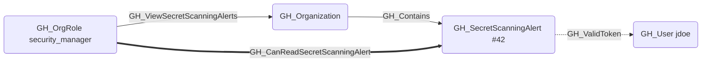
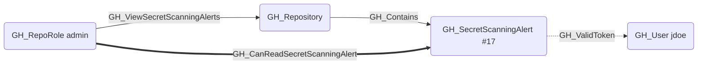

## Edge Schema

- Source: [GH_OrgRole](https://github.com/SpecterOps/bloodhound-docs/blob/main//opengraph/extensions/github/nodes/gh_orgrole), [GH_RepoRole](https://github.com/SpecterOps/bloodhound-docs/blob/main//opengraph/extensions/github/nodes/gh_reporole)
- Destination: [GH_SecretScanningAlert](https://github.com/SpecterOps/bloodhound-docs/blob/main//opengraph/extensions/github/nodes/gh_secretscanningalert)
- Traversable: ✅

## General Information

The traversable GH_CanReadSecretScanningAlert edge is a computed edge indicating that a role can read a specific secret scanning alert, including the leaked secret value. The computation cross-references [GH_ViewSecretScanningAlerts](https://github.com/SpecterOps/bloodhound-docs/blob/main//opengraph/extensions/github/edges/gh_viewsecretscanningalerts) permission edges with [GH_Contains](https://github.com/SpecterOps/bloodhound-docs/blob/main//opengraph/extensions/github/edges/gh_contains) structural edges (org-level and repo-level) to determine which alerts each role can access. This edge is traversable because reading an alert reveals the leaked secret — if the secret is a valid GitHub Personal Access Token, the [GH_ValidToken](https://github.com/SpecterOps/bloodhound-docs/blob/main//opengraph/extensions/github/edges/gh_validtoken) edge enables identity compromise of the token's owner.

Each edge includes a `reason` property (`org_role_permission` or `repo_role_permission`) and a `query_composition` Cypher query showing the underlying graph evidence.
## Scenarios

### `org_role_permission` — Org role views alerts via organization

An org role with [GH_ViewSecretScanningAlerts](https://github.com/SpecterOps/bloodhound-docs/blob/main//opengraph/extensions/github/edges/gh_viewsecretscanningalerts) to the organization can read all secret scanning alerts across the entire org. The computation follows [GH_Contains](https://github.com/SpecterOps/bloodhound-docs/blob/main//opengraph/extensions/github/edges/gh_contains) edges from the organization to each alert.

### `repo_role_permission` — Repo role views alerts via repository

A repo role with [GH_ViewSecretScanningAlerts](https://github.com/SpecterOps/bloodhound-docs/blob/main//opengraph/extensions/github/edges/gh_viewsecretscanningalerts) to the repository can read secret scanning alerts in that specific repo. The computation follows [GH_Contains](https://github.com/SpecterOps/bloodhound-docs/blob/main//opengraph/extensions/github/edges/gh_contains) edges from the repository to each alert.

