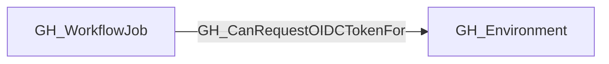

## Edge Schema

- Traversable: ✅

| Start | Kind | End |
|-------|-----------|-------|
| [GH_WorkflowJob](https://github.com/SpecterOps/bloodhound-docs/blob/main//opengraph/extensions/github/nodes/gh_workflowjob) | GH_CanRequestOIDCTokenFor | [GH_Environment](https://github.com/SpecterOps/bloodhound-docs/blob/main//opengraph/extensions/github/nodes/gh_environment) |

## General Information

The traversable GH_CanRequestOIDCTokenFor edge represents a static upper-bound capability: based on the collected workflow configuration, a GitHub Actions workflow job execution context may be able to request a GitHub-signed OIDC token containing claims for its associated GitHub Environment.

This edge is derived from the existing [GH_DeploysTo](https://github.com/SpecterOps/bloodhound-docs/blob/main//opengraph/extensions/github/edges/gh_deploysto) relationship and the job's calculated `effective_github_token_permissions`. The collector emits it only when the job targets a statically resolved environment and its effective permissions include `id-token:write`.

This is a capability edge, not evidence that the workflow has historically requested a token or contains an explicit OIDC-related step. Code executing in a job with `id-token:write` can request the token directly.

The edge does not model run-specific permission recalculation. In particular, a `pull_request` run originating from a fork may receive downgraded `GITHUB_TOKEN` permissions at runtime and therefore may not be able to request an OIDC token even when this edge exists. The edge should not be interpreted as proof that every execution of the job can request OIDC.

## Edge Schema

| Source | Destination | Traversable |
| --- | --- | --- |
| [GH_WorkflowJob](https://github.com/SpecterOps/bloodhound-docs/blob/main//opengraph/extensions/github/nodes/gh_workflowjob) | [GH_Environment](https://github.com/SpecterOps/bloodhound-docs/blob/main//opengraph/extensions/github/nodes/gh_environment) | `true` |

## Diagram

