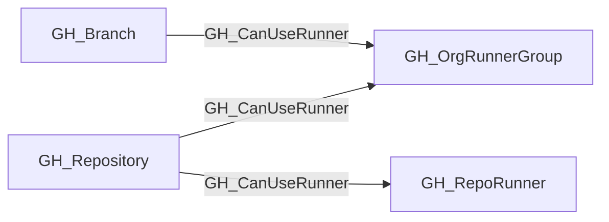

## Edge Schema

- Traversable: ✅

| Start | Kind | End |
|-------|-----------|-------|
| [GH_Repository](https://github.com/SpecterOps/bloodhound-docs/blob/main//opengraph/extensions/github/nodes/gh_repository) | GH_CanUseRunner | [GH_OrgRunnerGroup](https://github.com/SpecterOps/bloodhound-docs/blob/main//opengraph/extensions/github/nodes/gh_orgrunnergroup) |
| [GH_Branch](https://github.com/SpecterOps/bloodhound-docs/blob/main//opengraph/extensions/github/nodes/gh_branch) | GH_CanUseRunner | [GH_OrgRunnerGroup](https://github.com/SpecterOps/bloodhound-docs/blob/main//opengraph/extensions/github/nodes/gh_orgrunnergroup) |
| [GH_Repository](https://github.com/SpecterOps/bloodhound-docs/blob/main//opengraph/extensions/github/nodes/gh_repository) | GH_CanUseRunner | [GH_RepoRunner](https://github.com/SpecterOps/bloodhound-docs/blob/main//opengraph/extensions/github/nodes/gh_reporunner) |

## General Information

For runner-group-backed access, the traversable GH_CanUseRunner edge is a computed edge representing that a repository or branch can dispatch workflows to a self-hosted runner execution surface under the modeled runner-group controls.

The collector derives this edge from [GH_IsEligibleFor](https://github.com/SpecterOps/bloodhound-docs/blob/main//opengraph/extensions/github/edges/gh_iseligiblefor) rather than directly from repository visibility. It emits GH_CanUseRunner only when the repository is within the runner group's repository-access scope, GitHub Actions is enabled for the repository, and `restricted_to_workflows=false` on the organization-facing runner group. Inherited enterprise-backed access also requires `restricted_to_workflows=false` on the source [GH_EnterpriseRunnerGroup](https://github.com/SpecterOps/bloodhound-docs/blob/main//opengraph/extensions/github/nodes/gh_enterpriserunnergroup). Every collected branch in a repository that satisfies those conditions receives the same edge so branch write paths can reach the execution surface.

Organization and inherited enterprise-backed access terminate at the organization-facing [GH_OrgRunnerGroup](https://github.com/SpecterOps/bloodhound-docs/blob/main//opengraph/extensions/github/nodes/gh_orgrunnergroup), then continue through [GH_HasRunner](https://github.com/SpecterOps/bloodhound-docs/blob/main//opengraph/extensions/github/edges/gh_hasrunner) for native organization runners or through [GH_InheritedFrom](https://github.com/SpecterOps/bloodhound-docs/blob/main//opengraph/extensions/github/edges/gh_inheritedfrom) and [GH_HasRunner](https://github.com/SpecterOps/bloodhound-docs/blob/main//opengraph/extensions/github/edges/gh_hasrunner) for inherited enterprise runners. Repository-scoped runners currently receive GH_CanUseRunner directly from their containing repository and are not part of this runner-group traversability change.

## Edge Schema

| Source | Destination | Traversable |
| --- | --- | --- |
| [GH_Branch](https://github.com/SpecterOps/bloodhound-docs/blob/main//opengraph/extensions/github/nodes/gh_branch) | [GH_OrgRunnerGroup](https://github.com/SpecterOps/bloodhound-docs/blob/main//opengraph/extensions/github/nodes/gh_orgrunnergroup) | `true` |
| [GH_Repository](https://github.com/SpecterOps/bloodhound-docs/blob/main//opengraph/extensions/github/nodes/gh_repository) | [GH_OrgRunnerGroup](https://github.com/SpecterOps/bloodhound-docs/blob/main//opengraph/extensions/github/nodes/gh_orgrunnergroup) | `true` |
| [GH_Repository](https://github.com/SpecterOps/bloodhound-docs/blob/main//opengraph/extensions/github/nodes/gh_repository) | [GH_RepoRunner](https://github.com/SpecterOps/bloodhound-docs/blob/main//opengraph/extensions/github/nodes/gh_reporunner) | `false` |

## Diagram

