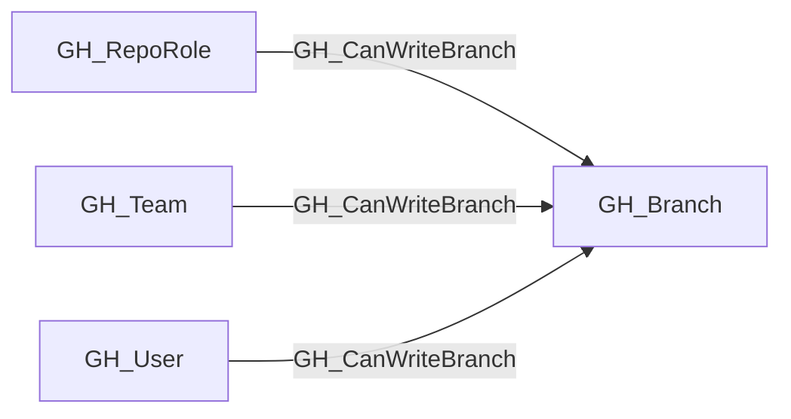
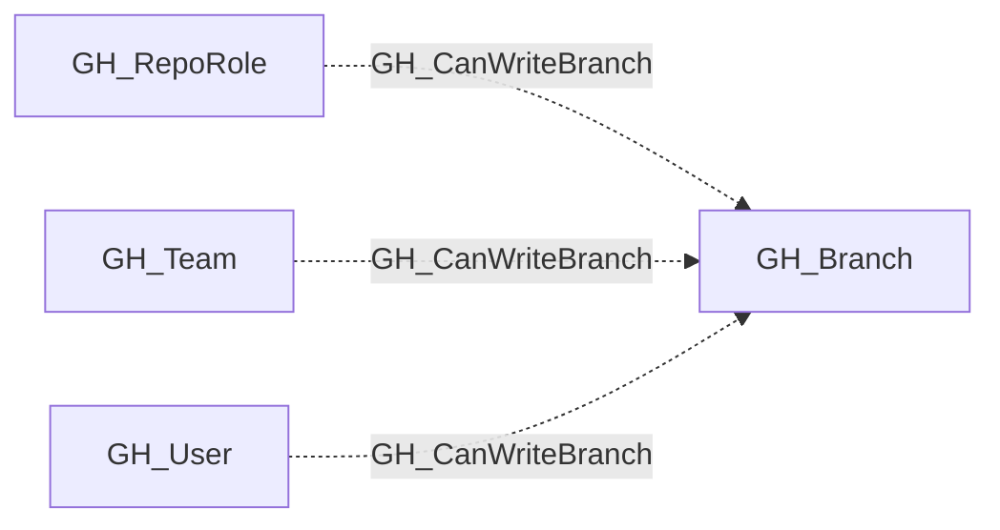

## Edge Schema

- Traversable: ✅

| Start | Kind | End |
|-------|-----------|-------|
| [GH_RepoRole](https://github.com/SpecterOps/bloodhound-docs/blob/main//opengraph/extensions/github/nodes/gh_reporole) | GH_CanWriteBranch | [GH_Branch](https://github.com/SpecterOps/bloodhound-docs/blob/main//opengraph/extensions/github/nodes/gh_branch) |
| [GH_User](https://github.com/SpecterOps/bloodhound-docs/blob/main//opengraph/extensions/github/nodes/gh_user) | GH_CanWriteBranch | [GH_Branch](https://github.com/SpecterOps/bloodhound-docs/blob/main//opengraph/extensions/github/nodes/gh_branch) |
| [GH_Team](https://github.com/SpecterOps/bloodhound-docs/blob/main//opengraph/extensions/github/nodes/gh_team) | GH_CanWriteBranch | [GH_Branch](https://github.com/SpecterOps/bloodhound-docs/blob/main//opengraph/extensions/github/nodes/gh_branch) |

## General Information

The traversable GH_CanWriteBranch edge is a computed edge indicating that a role or actor can push to a specific branch. The computation evaluates both the merge gate (PR review requirements) and push gate (push restrictions) of any branch protection rule protecting the branch. Role-level edges are the common case; per-actor edges from [GH_User](https://github.com/SpecterOps/bloodhound-docs/blob/main//opengraph/extensions/github/nodes/gh_user) or [GH_Team](https://github.com/SpecterOps/bloodhound-docs/blob/main//opengraph/extensions/github/nodes/gh_team) are only emitted when BPR allowances grant access beyond what the role provides. Each edge includes a `reason` property (`no_protection`, `admin`, `push_protected_branch`, `bypass_branch_protection`, `push_allowance`, `bypass_pr_allowance`) and a `query_composition` Cypher query showing the underlying graph evidence.

## Scenarios

### `no_protection` — Unprotected branch

Branch has no BPR. Any write-capable role can push directly.

## Edge Schema

| Source | Destination | Traversable |
| --- | --- | --- |
| [GH_RepoRole](https://github.com/SpecterOps/bloodhound-docs/blob/main//opengraph/extensions/github/nodes/gh_reporole) | [GH_Branch](https://github.com/SpecterOps/bloodhound-docs/blob/main//opengraph/extensions/github/nodes/gh_branch) | `false` |
| [GH_Team](https://github.com/SpecterOps/bloodhound-docs/blob/main//opengraph/extensions/github/nodes/gh_team) | [GH_Branch](https://github.com/SpecterOps/bloodhound-docs/blob/main//opengraph/extensions/github/nodes/gh_branch) | `false` |
| [GH_User](https://github.com/SpecterOps/bloodhound-docs/blob/main//opengraph/extensions/github/nodes/gh_user) | [GH_Branch](https://github.com/SpecterOps/bloodhound-docs/blob/main//opengraph/extensions/github/nodes/gh_branch) | `false` |

## Diagram

