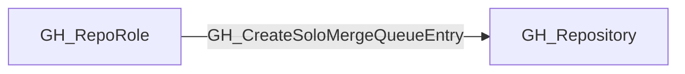

## Edge Schema

- Traversable: ❌

| Start | Kind | End |
|-------|-----------|-------|
| [GH_RepoRole](https://github.com/SpecterOps/bloodhound-docs/blob/main//opengraph/extensions/github/nodes/gh_reporole) | GH_CreateSoloMergeQueueEntry | [GH_Repository](https://github.com/SpecterOps/bloodhound-docs/blob/main//opengraph/extensions/github/nodes/gh_repository) |

## General Information

The non-traversable GH_CreateSoloMergeQueueEntry edge represents a role's ability to create solo merge queue entries, effectively bypassing the merge queue by merging independently of other queued changes. This permission is available to Admin roles and custom roles that have been granted this specific permission. Solo merge queue entries skip the batching and ordering guarantees of the merge queue, allowing changes to land without waiting for or being tested alongside other pending merges. This can circumvent the integration testing benefits that merge queues provide.

## Edge Schema

| Source | Destination | Traversable |
| --- | --- | --- |
| [GH_RepoRole](https://github.com/SpecterOps/bloodhound-docs/blob/main//opengraph/extensions/github/nodes/gh_reporole) | [GH_Repository](https://github.com/SpecterOps/bloodhound-docs/blob/main//opengraph/extensions/github/nodes/gh_repository) | `false` |

## Diagram

